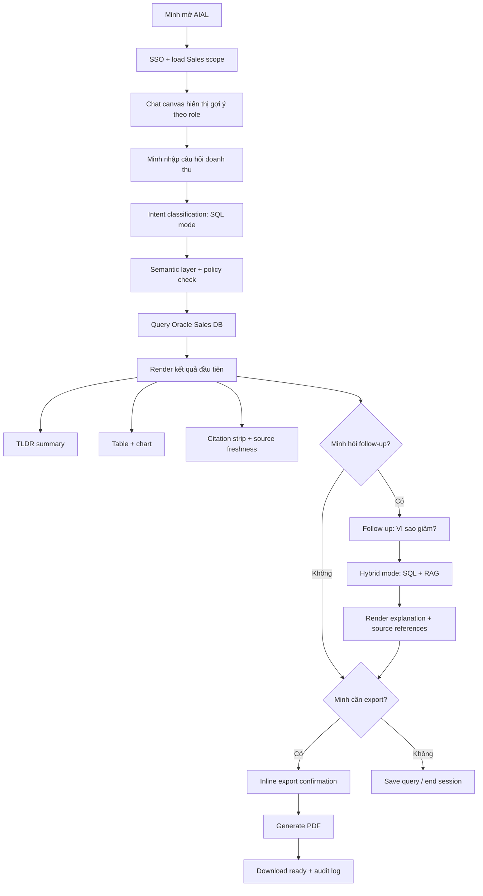
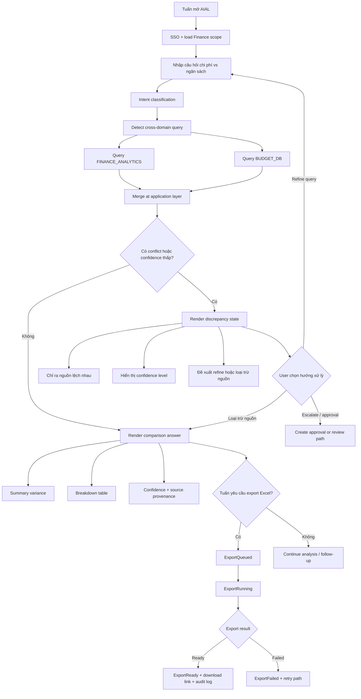
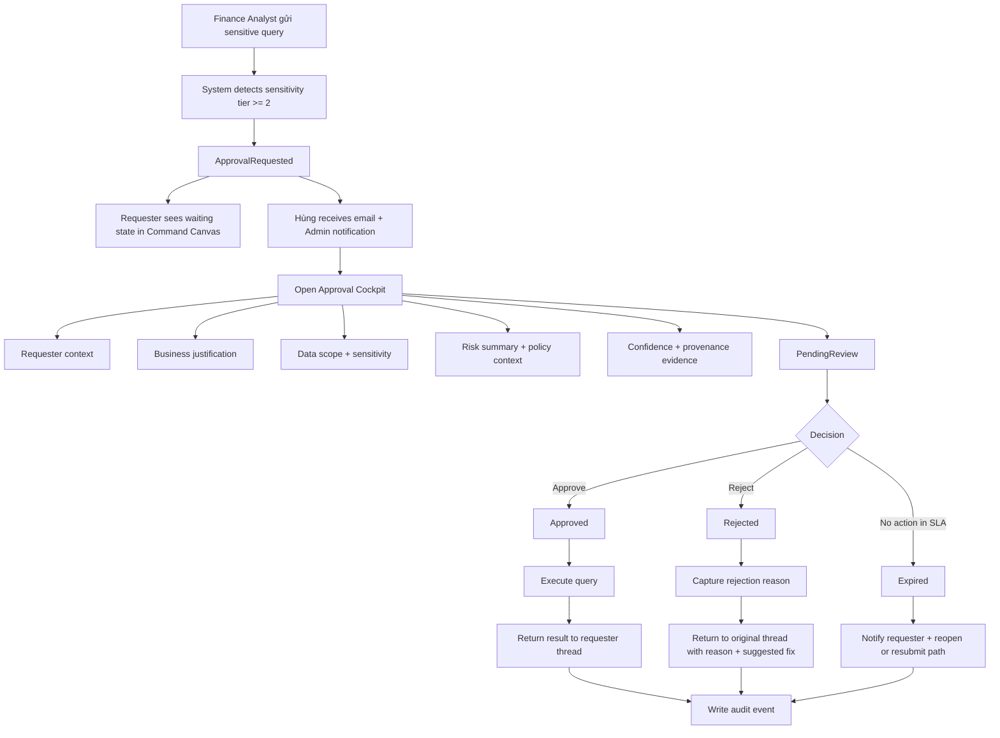
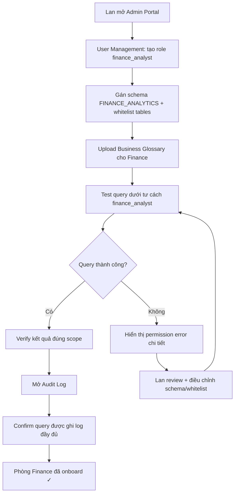
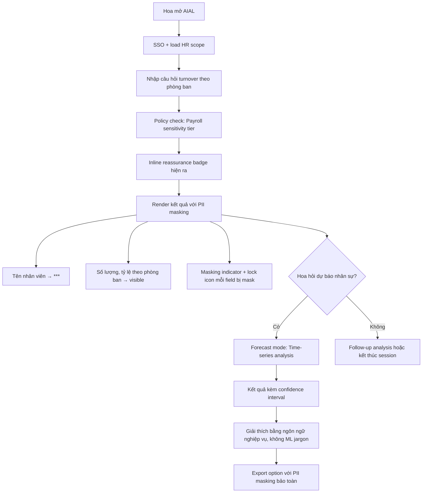
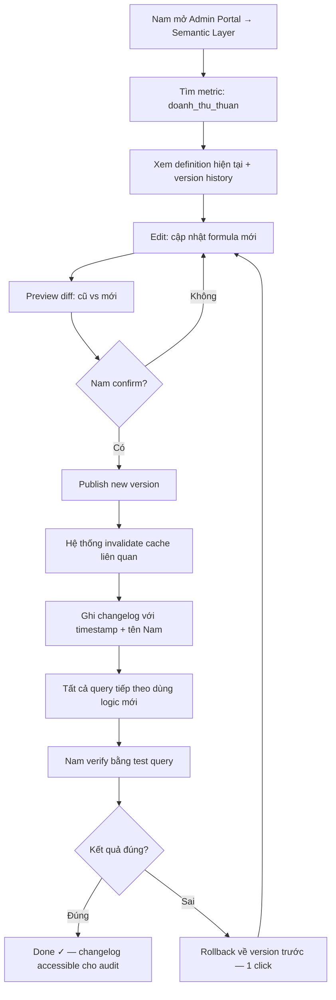
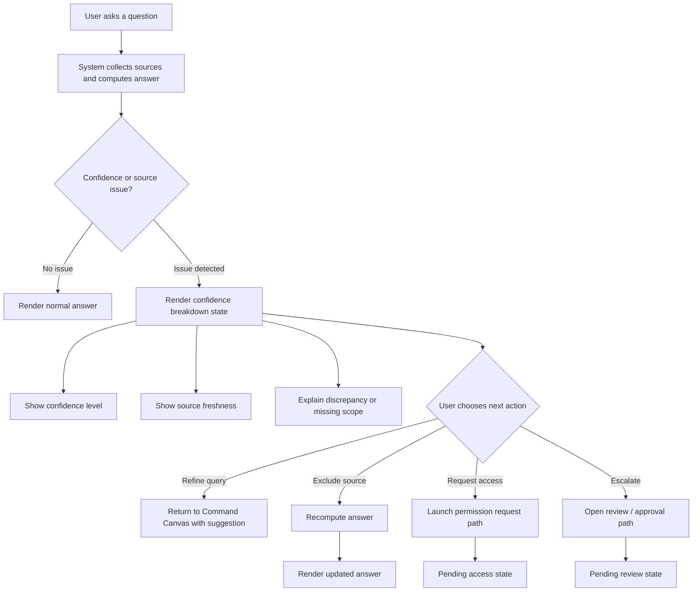

# UX Design Specification — Enterprise AI Data Assistant (AIAL)

**Author:** BOSS
**Date:** 2026-04-24

---

<!-- UX design content will be appended sequentially through collaborative workflow steps -->

---

## Navigation Guide

> **Note:** Sections dưới đây được append theo thứ tự workflow. Để đọc theo logical flow, tham chiếu bảng này:

| # | Section | Nội dung | Vị trí trong doc |
|---|---------|---------|----------------|
| 1 | [Executive Summary](#executive-summary) | Vision, personas, design challenges, opportunities | ~Section 8 |
| 2 | [Desired Emotional Response](#desired-emotional-response) | Professional Relief → Empowered Confidence | ~Section 5 |
| 3 | [UX Pattern Analysis & Inspiration](#ux-pattern-analysis--inspiration) | Perplexity, Notion AI, Linear, Copilot patterns | ~Section 6 |
| 4 | [Core User Experience](#core-user-experience) | ORIENT→ACT loop, platform strategy, onboarding | ~Section 7 |
| 5 | [Design System Foundation](#design-system-foundation) | shadcn/ui, color tokens, typography, components | ~Section 3 |
| 6 | [Defining Core Experience](#defining-core-experience) | "Hỏi bằng tiếng Việt → hành động ngay" mechanics | ~Section 1 |
| 7 | [Visual Design Foundation](#visual-design-foundation) | Color system, accessibility, grid, breakpoints | ~Section 2 |
| 8 | [Design Direction Decision](#design-direction-decision) | Command Canvas + Verified Ledger + Approval Cockpit | ~Section 9 |
| 9 | [User Journey Flows](#user-journey-flows) | 7 journeys: Minh, Lan, Tuấn, Hoa, Nam, Hùng, Error | ~Section 10 |
| 10 | [Component Strategy](#component-strategy) | 8 custom components + implementation roadmap | ~Section 11 |
| 11 | [UX Consistency Patterns](#ux-consistency-patterns) | Button hierarchy, feedback taxonomy, form patterns | ~Section 12 |
| 12 | [Responsive Design & Accessibility](#responsive-design--accessibility) | WCAG 2.2 AA, breakpoints, testing checklist | ~Section 13 |

**Cho AI coding agents:** Bắt đầu từ **Design Direction Decision** (Section 8) + **Component Strategy** (Section 10) + **UX Consistency Patterns** (Section 11) — đây là 3 sections critical nhất cho implementation.

---

## Defining Core Experience

> **Bước quan trọng nhất:** Nếu chỉ làm đúng một điều, đây là điều đó.

### The Defining Interaction

> **AIAL's defining experience:**
> *"Hỏi bằng tiếng Việt → nhận câu trả lời từ dữ liệu thật kèm nguồn → hành động ngay"*

Tương đương với:
- Tinder: "Swipe to match with people"
- Spotify: "Discover and play any song instantly"
- **AIAL: "Ask in Vietnamese → verified data answer → act immediately"**

Đây là điều Minh sẽ kể cho đồng nghiệp: *"Tôi hỏi bằng tiếng Việt, nó lấy số từ Oracle ra ngay, cho tôi biết số từ đâu, và tôi export được trong 3 phút."*

---

### User Mental Model

**Hiện tại — "Nhờ IT":**
```
Minh nhận ra cần số liệu
  → Soạn email cho IT team
  → Chờ 2-3 ngày
  → Nhận file Excel
  → Verify manually
  → Dùng trong báo cáo
```

**AIAL thay thế bằng — "Hỏi đồng nghiệp thông minh":**

Người dùng KHÔNG bring mental model "query tool" hay "dashboard" — họ bring mental model **"nói chuyện với đồng nghiệp hiểu database"**. Đây là điểm mấu chốt về UX language:

- ❌ Tránh: Terminologies như "query", "execute", "schema", "filter clause"
- ✅ Dùng: "hỏi", "tìm", "xem", "so sánh", "phân tích"

**Frustrations với current solutions:**
| Current Tool | User Hate |
|-------------|-----------|
| Excel manual | Phải biết đường vào Oracle; 2-3 ngày chờ IT |
| Power BI | Phải học interface phức tạp; static, không interactive |
| Email IT | Chậm, không có audit trail, khó follow-up |
| Ad-hoc SQL | Chỉ dev biết dùng; security risk |

**Điều users sẽ love:** *"Tôi chỉ cần nói tiếng Việt bình thường là ra số ngay, và tôi biết số đó từ đâu."*

---

### Success Criteria for Core Interaction

| Criterion | Metric | Target |
|-----------|--------|--------|
| **Speed** | TTFB first meaningful output | < 3 giây (không phải completion time) |
| **Accuracy** | Single-turn resolution (no rephrasing) | > 70% queries |
| **Trust** | Queries → export/share action | > 60% |
| **Verification** | Citation click rate | > 30% |
| **Retention** | D30 active users | > 65% |
| **Time saved** | vs. current IT ticket workflow | > 60% reduction |

**"This just works" signals:**
- User gõ xong → nhìn thấy kết quả ngay, không spinner im lặng
- User không cần rephrase câu hỏi lần 2
- User click "Xem nguồn" và thấy đúng bảng Oracle
- User forward kết quả cho manager trong cùng session

---

### Novel vs. Established Patterns

| Pattern | Type | Approach |
|---------|------|---------|
| **Natural language input** | Established (Google, ChatGPT) | Adopt directly — users know how to type questions |
| **Streaming text response** | Semi-established (ChatGPT primed expectation) | Adopt — but with enterprise Progress Narration |
| **Citation badges `[1][2]`** | Novel cho Oracle data context | Adapt từ Perplexity — education nhẹ nhàng qua first-use tooltip |
| **Intent Confirmation** | Novel — AI paraphrase trước execute | Need onboarding: explain "AI hỏi lại để đảm bảo chính xác" |
| **Approval workflow trong AI** | Established behavior (Teams/email approval) nhưng novel context | Leverage Teams mental model — familiar notification pattern |
| **Streaming data table** | Novel — row-by-row real-time | Progressive reveal làm quen dần |

**Giáo dục user cho Novel patterns:**
- Citation badges: First-time tooltip *"Số trong ngoặc là nguồn dữ liệu — click để xem chi tiết"*
- Intent Confirmation: First time hiện explanation *"AI hỏi lại để đảm bảo hiểu đúng câu hỏi của bạn"*
- Streaming table: Visual flow tự giải thích — rows đổ vào tự nhiên

---

### Experience Mechanics — Step-by-Step Core Loop

**Initiation — User bắt đầu:**
```
Chat input field luôn visible (không hidden)
Placeholder text theo role:
  Sales: "VD: Doanh thu chi nhánh HCM tháng này?"
  Finance: "VD: Chi phí vận hành Q1 so với ngân sách?"
  HR: "VD: Tỷ lệ nghỉ việc theo phòng ban 6 tháng đầu năm?"

Visible Context Indicator (nếu có session context):
  "AI đang nhớ: Doanh thu Q1 & Q2, năm 2024 [X]"

Suggested queries appear (if idle > 3s):
  3 chips phù hợp với role + lịch sử
```

**Interaction — User hỏi, AI xử lý:**
```
User gõ → pause 500ms → ghost text suggestion xuất hiện
User submit → immediate echo của câu hỏi (Acknowledgment: 0-300ms)

Thinking Pulse Phase 1 (0-300ms):
  → Echo câu hỏi + "Đang phân tích..."

Thinking Pulse Phase 2 (300ms-2s):
  → Thinking animation (3 chấm không đều)

[Nếu intent_ambiguous → IntentConfirmationDialog]
  → "Tôi hiểu bạn muốn xem doanh thu thuần (không VAT), đúng không?"
  → [Đúng, tiếp tục] [Không, để tôi sửa lại]

Thinking Pulse Phase 3 (2s+):
  → "Bước 1/4: Đang phân loại câu hỏi..."
  → "Bước 2/4: Truy vấn Oracle Sales DB..."
  → "Bước 3/4: Đối chiếu với tài liệu..."
  → "Bước 4/4: Tổng hợp kết quả..."
```

**Feedback — Response xuất hiện:**
```
StreamingMessage bắt đầu stream (TTFB target: <3s):
  → Narrative text stream dần
  → Citation badges [1][2] xuất hiện inline
  → ProgressiveDataTable: rows đổ vào từng dòng (locked headers)
  → ChartReveal: fade-in khi JSON stream complete
  → Source cards accordion bên dưới (expandable)

Data freshness indicator:
  🟢 "Dữ liệu cập nhật đến: 09:00 hôm nay"

StreamAbortButton visible: [Hủy] (ghost button, không prominent)
```

**Completion — User verify và act:**
```
Stream complete → actions appear:
  Quick action chips: "Phân tích chi tiết" | "Xuất Excel" | "So sánh tháng trước"

User click "Xem nguồn [1]":
  → CitationBadge hover → Tooltip:
    "Nguồn: bảng SALES_FACT, cột revenue_q3
     Truy vấn: SELECT SUM... (collapse by default)
     Cập nhật: 09:00 sáng nay
     Xác thực: a3f2..."

User click "Generate Report":
  → ExportConfirmationBar slide up (sticky bottom, non-modal):
    "Xuất 3,420 rows, format: Excel"
    [Cancel] [Xác nhận →]
    → Auto-dismiss 30s nếu không action

Report job submitted:
  → Toast: "Đang tạo báo cáo... [icon spinning]"
  → User tiếp tục chat bình thường
  → Toast update: "Báo cáo đã sẵn sàng ↗ Tải xuống"

Follow-up:
  → Context preserved: "Còn tháng trước thì sao?" → AI hiểu ngữ cảnh
  → Visible Context Indicator update: "AI đang nhớ: Doanh thu Q3 2024 theo chi nhánh"
```

**Recovery — Khi có lỗi:**
```
Mọi error state có 3 exits (không dead end):
  network_timeout → [Thử lại] [Câu hỏi mới] [Liên hệ IT]
  data_unavailable → [Thử range khác] [Xuất mẫu] [Hỏi Nam]
  permission_denied → [Yêu cầu quyền] [Xem tôi được phép hỏi gì]
  auth_expired → [Đăng nhập lại + giữ câu hỏi]
```

---

## Visual Design Foundation

> **Nguồn:** Design System Foundation (Step 6) + Accessibility layer bổ sung
> Brand guidelines: Không có existing guidelines — AIAL là new enterprise internal tool. Design language defined fresh từ Step 6.

### Color System

**Primary:** Deep Teal `#0F7B6C` — intersection của trust (blue) và data-alive (green). Không phải navy-blue nhàm như SAP, không phải electric-blue lạnh như Power BI.

**Full palette tham chiếu:** Xem Design System Foundation → Color Palette section.

**Accessibility — Contrast Ratios (WCAG 2.1 AA minimum):**

| Combination | Contrast Ratio | WCAG Level | Notes |
|-------------|---------------|------------|-------|
| Primary `#0F7B6C` on White `#FFFFFF` | 4.8:1 | ✅ AA | Buttons, links |
| Gray-900 `#1A1917` on White | 16.8:1 | ✅ AAA | Primary text |
| Gray-600 `#6B6866` on White | 5.2:1 | ✅ AA | Secondary text |
| Gray-400 `#9B9896` on White | 3.1:1 | ⚠️ AA Large only | Use for placeholder/disabled only |
| Live `#22C55E` on White | 1.8:1 | ❌ Fail alone | Must use text label alongside icon |
| Stale `#EF4444` on White | 4.5:1 | ✅ AA | OK with adequate size |

**Color blindness considerations:**
- Semantic status không dựa ONLY vào màu — luôn kèm text label + icon: 🟢 Live / 🟡 Cached / 🔴 Stale
- Data visualization palette: không dùng red+green adjacent (dichromacy users) — Viz-1 (teal) + Viz-2 (indigo) safe combination

### Typography System

**Font:** `'Inter', 'Noto Sans', 'Noto Sans Vietnamese', sans-serif`

**Tone:** Professional + approachable — không corporate-bland, không consumer-casual.

**Scale reference:** Xem Design System Foundation → Typography section (Admin 14px base / Chat 15px base).

**Accessibility:**
- Minimum body text: 14px (Vietnamese diacritics cần space, không xuống 12px)
- Line height minimum: 1.5 (WCAG 1.4.8)
- Font weight: không dùng 300 (thin) — minimum 400 regular
- Letter spacing: không negative

### Spacing & Layout Foundation

**Base unit:** 4px (Tailwind default, works with 8px grid)

**12-column grid:**
```
Desktop (≥1280px): 12 columns, gutter 24px, margin 48px
Laptop  (≥1024px): 12 columns, gutter 16px, margin 32px
Tablet  (≥768px):  8 columns,  gutter 16px, margin 24px
Mobile  (≥375px):  4 columns,  gutter 12px, margin 16px
```

**App layout structures:**

**Chat UI — Conversational Layout:**
```
┌──────────────────────────────────────┐
│  Header (64px) — logo + user menu   │
├──────────────────────────────────────┤
│  Sidebar (280px)  │  Main Chat Area  │
│  - History        │  - Messages      │
│  - Saved queries  │  - Input bar     │
│  - Suggestions    │  (fixed bottom)  │
└──────────────────────────────────────┘
```

**Admin Portal — Command Layout:**
```
┌──────────────────────────────────────────────┐
│  Header (56px) — logo + nav + notifications  │
├────────────────┬─────────────────────────────┤
│  Sidebar       │  Content Area               │
│  (240px fixed) │  - Breadcrumb               │
│  - Nav items   │  - Page title               │
│  - Collapse    │  - Main content (12-col)    │
│                │  - Action bar (bottom)       │
└────────────────┴─────────────────────────────┘
```

**Responsive Breakpoints:**

| Breakpoint | Width | App Behavior |
|------------|-------|-------------|
| `xs` | < 375px | Not supported (enterprise minimum) |
| `sm` | 375px | Chat UI: mobile optimized flows (Minh, Hùng exception) |
| `md` | 768px | Chat UI: tablet, sidebar collapses to drawer |
| `lg` | 1024px | Default laptop, both apps full layout |
| `xl` | 1280px | Optimal desktop experience |
| `2xl` | 1536px | Wide monitor, content max-width capped at 1200px |

**Mobile exception flows (Chat UI only):**
- Minh: simplified result view (no full table, no export)
- Hùng: read-only approval card với approve/reject on mobile
- Admin Portal: desktop-only, mobile shows "Please use desktop" message

### Accessibility Considerations

**WCAG 2.1 AA compliance (minimum):**

| Requirement | Implementation |
|-------------|---------------|
| Color contrast 4.5:1 (text) | Validated per table above |
| Focus visible | shadcn/ui + `shadow-focus` ring (3px teal ring) |
| Keyboard navigation | Full keyboard access (Radix UI handles) + Cmd+K palette |
| Screen reader | ARIA live regions trên streaming content; role="log" |
| Touch target | Minimum 44×44px (WCAG 2.5.5) |
| Animation reduction | Respect `prefers-reduced-motion` — disable shimmer, transitions |
| Language | `lang="vi"` trên HTML element |

**ARIA patterns cho streaming:**
```html
<!-- StreamingMessage -->
<div role="log" aria-live="polite" aria-label="AI response">
  {streamingContent}
</div>

<!-- Thinking state -->
<div role="status" aria-live="polite" aria-label="AI đang xử lý">
  Bước 2/4: Đang truy vấn Oracle...
</div>

<!-- Citation badge -->
<button aria-label="Xem nguồn dữ liệu số 1">
  [1]
</button>
```

**Prefers-reduced-motion:**
```css
@media (prefers-reduced-motion: reduce) {
  .skeleton { animation: none; background: var(--gray-100); }
  .stream-cursor { animation: none; opacity: 1; }
  * { transition-duration: 0.01ms !important; }
}
```

---

## Design System Foundation

> **Nguồn:** Architecture Document (shadcn/ui locked) + Party Review (Sally + Amelia + Paige)

### Design System Choice: shadcn/ui + Tailwind CSS

**Category:** Themeable System — copy-paste component collection (không phải dependency)
**Foundation:** Radix UI primitives (accessibility-first) + Tailwind CSS (utility styling)
**Package:** `@aial/ui` trong `packages/ui/` — shared giữa `apps/chat` và `apps/admin`

**Lý do chọn:**
- Full control — không fight library khi customize
- Accessibility built-in qua Radix UI (ARIA, keyboard navigation)
- No vendor lock-in — code là của project
- 2 apps dùng chung foundation, khác interaction paradigm theo density mode

---

### Color Palette — "Controlled Boldness"

> *"Warm teal anchor + warm gray backgrounds + Inter typography = Trustworthy Intelligence"* — Sally

**Primary Brand Color:**
```
Primary:       #0F7B6C   (Deep Teal — intersection of trust/blue và data-alive/green)
Primary-light: #14A899   (hover states)
Primary-dark:  #0A5C51   (pressed, active)
```

**Semantic Status Colors:**
```
Live    (#22C55E / green-500) + bg #F0FDF4 (green-50)   — data < 1 giờ
Cached  (#EAB308 / yellow-500) + bg #FEFCE8 (yellow-50) — data 1-24 giờ
Stale   (#EF4444 / red-500) + bg #FEF2F2 (red-50)       — data > 24 giờ
```

**Neutral System (Warm Gray — không phải pure gray):**
```
Gray-50:  #F8F7F5   (warm white — backgrounds; "paper, document, trustworthy records")
Gray-100: #F0EFED   (card surfaces)
Gray-200: #E3E2DF   (borders, dividers)
Gray-400: #9B9896   (placeholder text)
Gray-600: #6B6866   (secondary text)
Gray-900: #1A1917   (primary text — không phải pure black #000)
```

**Data Visualization Palette (8 màu, tránh clash với semantic colors):**
```
Viz-1: #0F7B6C  Viz-2: #6366F1  Viz-3: #F59E0B  Viz-4: #EC4899
Viz-5: #06B6D4  Viz-6: #8B5CF6  Viz-7: #84CC16  Viz-8: #F97316
```
*Note: Viz-3 dùng amber (#F59E0B), không phải yellow, để tránh confusion với Cached status.*

**Dark Mode Colors (Chat UI only):**
```
Background:     #0F1117   (near-black với blue undertone)
Surface:        #1A1D27
Surface-hover:  #242838
Border:         #2D3244
Primary:        #14A899   (lighter teal cho dark context)
Text-primary:   #E8EAED
Text-secondary: #9AA0B0
```

---

### Typography

**Font stack:**
```css
font-family: 'Inter', 'Noto Sans', 'Noto Sans Vietnamese', sans-serif;
```
Inter primary cho Latin characters. Noto Sans Vietnamese fallback — thiết kế riêng cho Vietnamese diacritics (ắ, ở, ượ, ề...), x-height tương đồng Inter → transition invisible.

**Font Scale — Admin Portal (Compact, 14px base):**

| Token | Size | Weight | Line Height | Use Case |
|-------|------|--------|-------------|---------|
| text-xs | 11px | 400 | 1.4 | Table metadata, chip labels |
| text-sm | 12px | 400 | 1.5 | Timestamps, secondary info |
| text-base | 14px | 400 | 1.5 | Default body (enterprise standard) |
| text-md | 15px | 500 | 1.5 | Form labels, primary content |
| text-lg | 18px | 600 | 1.4 | Section headers |
| text-xl | 22px | 700 | 1.3 | Page titles |
| text-2xl | 28px | 700 | 1.2 | Dashboard hero numbers |

**Font Scale — Chat App (Relaxed, 15px base):**

| Token | Size | Weight | Line Height | Use Case |
|-------|------|--------|-------------|---------|
| text-base | 15px | 400 | 1.6 | Chat messages |
| text-lg | 18px | 500 | 1.5 | User questions |
| text-xl | 24px | 700 | 1.3 | Greeting/onboarding |

*Lý do 14px cho Admin: Power BI, Tableau, Linear dùng 13-14px cho data tables. 16px cảm giác "too large", waste screen estate. Không xuống 12px vì Vietnamese diacritics cần không gian render rõ.*

---

### Dark Mode Strategy

| App | Dark Mode | Lý do |
|-----|-----------|-------|
| **Chat UI** | ✅ Phase 1 | Conversational AI tools dùng ban đêm; Claude/ChatGPT/Perplexity đã set expectation; mobile low-light |
| **Admin Portal** | ❌ Defer Phase 2 | Configuration work = daytime, office context; data tables trong dark mode cần design effort gấp 3; enterprise users không expect dark mode cho "serious business tools" |

---

### Spacing — ONE Token System, TWO Density Modes

**Base Token System (shared):**
```
space-1: 4px  | space-2: 8px  | space-3: 12px | space-4: 16px
space-5: 20px | space-6: 24px | space-8: 32px | space-10: 40px
space-12: 48px | space-16: 64px
```

**Density Mode: "Comfortable" (Chat App):**
```
--card-padding:   24px (space-6)
--section-gap:    32px (space-8)
--border-radius:  12px (friendly, rounded)
--input-height:   48px
--message-gap:    16px (space-4)
```

**Density Mode: "Compact" (Admin Portal):**
```
--card-padding:       16px (space-4)
--section-gap:        16px (space-4)
--table-row-height:   40px
--border-radius:      6px  (sharp, precise)
--input-height:       36px
--sidebar-width:      240px
```

---

### Visual Personality — "Intelligent Clarity"

**Formula:** Linear's precision + Notion's calm

| Dimension | Notion | Linear | Power BI | **AIAL** |
|-----------|--------|--------|----------|---------|
| Speed feeling | Editorial | Sharp | Heavy | Responsive, confident |
| Data density | Low | Medium | High | Medium-High |
| Trust signal | Personal | Technical | Corporate | **Professional** |
| Animation | Minimal | Snappy | Heavy | Purposeful |

**Shadow System:**
```
shadow-sm:    0 1px 2px rgba(0,0,0,0.05)    — cards resting
shadow-md:    0 4px 12px rgba(0,0,0,0.08)   — dropdowns, tooltips
shadow-lg:    0 8px 24px rgba(0,0,0,0.12)   — modals, sidebars
shadow-focus: 0 0 0 3px rgba(15,123,108,0.15) — focus rings (primary)
```

**Border Radius Rules:**
```
Buttons/inputs: 6px    Chips/tags: 4px    Cards: 8px
Modals:         12px   Avatars:    50%    Charts container: 4px
```

**Animation Principles:**
```
Micro-interactions: 150ms ease-out   (hover, button press)
Panel transitions:  250ms ease-out   (sidebar, drawer)
Data loading:       skeleton shimmer 1.5s loop
Streaming text:     typewriter caret, no jitter
Success state:      200ms scale 1→1.05→1 (subtle pop)
```

---

### Implementation Architecture (Amelia)

**packages/ui structure (source-first, không build dist):**
```
packages/ui/
├── package.json           # name: "@aial/ui"; exports: "." và "./tailwind"
├── tailwind.config.ts     # exports baseConfig
└── src/
    ├── index.ts           # barrel exports
    ├── styles/tokens.css  # CSS custom properties (HSL format)
    ├── lib/
    │   ├── utils.ts       # cn() helper
    │   └── chart-theme.ts # getCSSVar() + getChartTheme()
    ├── hooks/
    │   └── useChartTheme.ts
    └── components/
        ├── ui/            # shadcn primitives (Button, Card, Badge, Tooltip...)
        └── custom/        # AIAL-specific components
            ├── StreamingMessage/
            │   ├── StreamingMessage.tsx
            │   ├── StreamingMessage.types.ts
            │   ├── StreamingMessage.test.tsx
            │   └── states/ (IdleState, ThinkingState, StreamingState, CompleteState, ErrorState, AbortedState)
            ├── ProgressiveDataTable/
            ├── StreamAbortButton/
            ├── ChartReveal/
            ├── CitationBadge/
            └── ConnectionStatusBanner/
```

**Custom components split (domain-aware):**

| Component | Location | Lý do |
|-----------|---------|-------|
| StreamingMessage, ProgressiveDataTable, ChartReveal, CitationBadge, StreamAbortButton, ConnectionStatusBanner | `packages/ui` | Generic — không biết domain logic |
| IntentConfirmationDialog | `apps/chat/src` | Chat domain specific |
| ExportConfirmationBar, ApprovalBriefingCard | `apps/admin/src` | Admin domain specific |

**CSS Design Tokens (HSL format — shadcn standard):**
```css
/* packages/ui/src/styles/tokens.css */
:root {
  --color-primary: 171 80% 27%;       /* #0F7B6C */
  --color-streaming: 142 76% 36%;     /* green — streaming state */
  --color-live: 142 71% 45%;
  --color-cached: 38 92% 50%;
  --color-stale: 0 84% 60%;
  --duration-stream: 150ms;
  --duration-reveal: 400ms;
}
.dark { --color-primary: 174 78% 35%; }
```

**Tailwind config sharing:**
```ts
// packages/ui/tailwind.config.ts → export baseConfig
// apps/chat/tailwind.config.ts → { ...baseConfig, content: [...] }
// apps/admin/tailwind.config.ts → same pattern
```

**Recharts theming (CSS vars at runtime):**
```ts
function getChartTheme() {
  // Read CSS vars → consistent với shadcn theme
  // useChartTheme() hook re-derives khi dark mode toggle
}
// Usage: <Line stroke={theme.colors[0]} />  → tự động theme-aware
```

---

### Component Documentation Standard (Paige)

**Every component spec MUST include (AI agent self-contained contract):**

```
1. Purpose        — 1 câu: làm gì + không dùng khi nào
2. Anatomy        — ASCII DOM hierarchy
3. Props Contract — table: Prop | Type | Default | Required | Description
4. State Machine  — 3 layers (nếu stateful)
5. Tokens Used    — chỉ tokens thực sự dùng
6. Variants       — code snippets đầy đủ
7. Do / Don't     — explicit anti-pattern examples
8. Accessibility  — role, aria-label, aria-live, keyboard
9. Integration    — deps, data-testid pattern, performance notes
```

**StreamingMessage State Machine (3 layers):**

Layer 1 — ASCII Flow:
```
IDLE ──[start]──► STREAMING ──[chunk]──► BUFFERING ──[flush]──► STREAMING
                                │                                     │
                           [error]                           [stream end]
                                │                                     │
                                ▼                                     ▼
                             ERROR ──[retry]──► IDLE            COMPLETE
                                                                     │
                                                               [copy action]
                                                                     ▼
                                                              COPY_SUCCESS
                                                             ──[1500ms]──► COMPLETE
```

Layer 2 — Transition Table:

| Current State | Trigger | Next State | Side Effect |
|---------------|---------|------------|-------------|
| IDLE | `onStreamStart()` | STREAMING | Show skeleton cursor |
| STREAMING | chunk received | BUFFERING | Append to buffer |
| BUFFERING | buffer flush (150ms) | STREAMING | Re-render content |
| STREAMING | `onStreamEnd()` | COMPLETE | Hide cursor, show actions |
| COMPLETE | `onCopy()` | COPY_SUCCESS | Write to clipboard |
| COPY_SUCCESS | 1500ms timeout | COMPLETE | Reset button icon |
| STREAMING/BUFFERING | error event | ERROR | Show error UI |
| ERROR | `onRetry()` | IDLE | Clear content |

Layer 3 — Code Contract:
```typescript
type StreamingState = 'idle' | 'streaming' | 'buffering' | 'complete' | 'copy_success' | 'error'

// Forbidden transitions (AI agent phải biết):
// COMPLETE → STREAMING (không stream lại)
// IDLE → COMPLETE (phải qua STREAMING)
// Bất kỳ state → IDLE ngoài ERROR
```

**6 Anti-patterns hay bị AI agents implement sai (DO/DON'T):**

| # | Anti-pattern | ❌ DON'T | ✅ DO |
|---|-------------|---------|------|
| 1 | Token hardcoding | `className="bg-gray-100"` | `className="bg-background-secondary"` |
| 2 | Inline state ternary | `state === 'x' ? 'a' : state === 'y' ? 'b' : 'c'` | `STATE_MAP[state]` |
| 3 | Missing aria-live | `<div>{streamingContent}</div>` | `<div role="log" aria-live="polite">` |
| 4 | Citation index từ `.map()` | `<CitationBadge number={index + 1} />` | `<CitationBadge number={c.citationNumber} />` |
| 5 | Approve không confirm | `<Button onClick={() => onApprove(id)}>` | Luôn có ConfirmationDialog |
| 6 | Boolean loading | `const [isLoading, setIsLoading] = useState(false)` | `useState<'idle'\|'loading'\|'success'\|'error'>('idle')` |

**Design Token Reference Card (Quick Lookup by INTENT):**
```
# Ctrl+F → search by intent
ChatInput:           bg-background, border-subtle, radius-md
StreamingMessage:    bg-ai-message, text-primary, radius-lg, shadow-none
CitationBadge:       bg-background-secondary, border-subtle, radius-sm, text-sm
ApprovalCard:        bg-background, border-subtle, shadow-md, radius-xl
StatusIndicator:     text-success / text-destructive / text-muted
DataTable (admin):   border-subtle, bg-background-secondary (alt rows)
```

**Documentation file structure:**
```
design-system/
├── TOKEN_REFERENCE.md       ← Quick lookup (Ctrl+F by intent)
├── COMPONENT_TEMPLATE.md    ← Blank template
├── ANTI_PATTERNS.md         ← 6+ Do/Don't catalog
└── components/
    ├── StreamingMessage.md
    ├── CitationBadge.md
    ├── ApprovalBriefingCard.md
    └── ...
```

---

## Executive Summary

> **Nguồn:** PRD v2.1 + Architecture Document + Party Review (Sally + Mary + John)

### Project Vision

**Enterprise AI Data Assistant (AIAL)** không phải chatbot hỏi đáp thông thường — đây là **nền tảng truy cập dữ liệu có governance dành cho AI**. Người dùng hỏi bằng tiếng Việt, hệ thống truy vấn Oracle DB + tài liệu nội bộ, trả về câu trả lời kèm SQL gốc và nguồn trích dẫn cụ thể.

**Giá trị UX cốt lõi: "Verified Truth"** — mọi câu trả lời đều traceable, mọi con số đều có "dấu vân tay dữ liệu".

**Hai app entry points với cognitive model khác nhau hoàn toàn:**
- **Chat UI** (`apps/chat`): mobile-first → desktop, conversational, streaming, simple
- **Admin Portal** (`apps/admin`): desktop-first, configuration-heavy, information density cao

**Underlying theme xuyên suốt tất cả personas:** *Autonomy + Confidence + Accountability Protection* — người dùng không chỉ muốn data, họ muốn **cảm thấy an toàn khi dùng data này để ra quyết định**.

---

### Target Users

#### Primary Personas (6 operational users)

| Persona | Role | Thiết bị ưu tiên | Critical Moment | Real Job To Be Done |
|---------|------|-----------------|----------------|---------------------|
| **Minh** | Sales Lead | 📱 Mobile → Desktop | Đang gọi điện khách hàng — cần answer trong **30 giây** | "Tự tin bước vào cuộc họp với con số tôi tin, không phụ thuộc ai" |
| **Tuấn** | Finance Manager | 💻 Desktop | EOD deadline **4:45 PM** — không chờ được lỗi UI | "Bảo vệ bản thân — số liệu tôi ký tên lên phải chính xác" |
| **Hoa** | HR Manager | 💻 Desktop | Data nhạy cảm — cần **biết rõ** gì bị mask, gì không | "Trả lời management trong 5 phút, không phải 5 ngày" |
| **Lan** | IT Admin | 💻 Desktop | Configuration phức tạp — cần **information density cao** | "Kiểm soát ai thấy gì — không để incident xảy ra mà tôi phải giải trình" |
| **Nam** | Data Owner | 💻 Desktop | Chỉnh sửa KPI definition — cần **version control rõ ràng** | "Bảo vệ domain của tôi trong khi vẫn enable business" |
| **Hùng** | Approval Officer | 💻 Desktop | Queue approval — **time pressure**, không thể sai | "Ra quyết định có đủ context — không ký mù và chịu hậu quả" |

#### Secondary Personas (cần support — currently underserved)

| Persona | Role | UX Need |
|---------|------|---------|
| **Executive Viewer** (CEO/CFO) | C-Suite | Dashboard tổng hợp cross-department; "signal not noise"; board-ready narrative — không cần drill-down |
| **Compliance Auditor** | Legal/Audit | Query *về ai đã query gì* — access logs, data masking verification, audit trail. Không query data để phân tích. |
| **Department Head / Team Lead** | Middle Management | Casual power users — review team performance định kỳ. Quyết định adoption của cả team. |

#### User Success Metrics (3 khoảnh khắc cụ thể)

| Khoảnh khắc | Mô tả | Proxy Metric | Target |
|-------------|-------|-------------|--------|
| **"Aha — Tôi hiểu câu trả lời"** | Nhận response không cần hỏi thêm "số này tính thế nào?" | % queries với single-turn resolution | >70% |
| **"Tôi dám dùng số này trong cuộc họp"** | Thấy data lineage đủ để tự tin share | % successful queries → export action | >60% |
| **"Lần sau tôi không cần ticket IT"** | Tự resolve need mà trước đây phải wait 2-3 ngày | D30 retention rate | >65% |

---

### Key Design Challenges

#### Challenge 1 — SSE Streaming State Management (Critical)

6 states phải có visual treatment riêng biệt: `idle → thinking → streaming → rendering → complete → error`

**"Thinking state" là moment quan trọng nhất** — khi LLM đang xử lý chưa có token nào, đây là khoảnh khắc người dùng quyết định có trust hệ thống không.

**3 micro-phases của Thinking State:**
- **0–300ms:** Immediate Acknowledgment — echo lại câu hỏi + "Đang phân tích..."
- **300ms–2s:** Active Thinking Signal — "thinking pulse" animation không đều (không phải spinner đơn thuần)
- **2s+:** Progress Narration — kể cho user nghe: *"Đang tìm kiếm dữ liệu... → Đang truy vấn cơ sở dữ liệu... → Đang phân tích kết quả..."*

**Cancel + retry UX:** Sau 8 giây, hiện subtle timestamp *"Đã chờ 8 giây"* và nút `[Hủy yêu cầu]` ghost button.

#### Challenge 2 — Data Masking Visualization

`***-1234` trông giống data thật. Hoa (HR) không phân biệt được masked vs actual data — UX failure nghiêm trọng nếu không design đúng.

Cần visual treatment riêng: lock icon + tooltip *"Trường này được ẩn để bảo vệ thông tin cá nhân"* + hover interaction cho phép request unmask nếu có quyền.

#### Challenge 3 — Dual Cognitive Model

Chat UI (conversational, simple, mobile) và Admin Portal (dense, config-heavy, desktop) có 2 cognitive model hoàn toàn khác nhau. Cùng design system (shadcn/ui) nhưng khác interaction paradigm. Không thể design một cách cho cả hai.

#### Challenge 4 — Trust & Transparency cho Vietnamese Business Users

4 nguồn trust anxiety đặc thù:
1. **"AI bịa số"** — Tuấn và Finance team sợ hallucination
2. **"Sếp xem được không?"** — Hoa lo query bị ai thấy
3. **"Nếu sai thì ai chịu?"** — accountability culture VN
4. **"AI có hiểu tiếng Việt đặc thù không?"** — business terminology VN rất đặc thù

#### Challenge 5 — Empty States & Graceful Degradation

4 scenarios khác nhau, mỗi cái cần message và call-to-action riêng:
- Permission denied (ABAC reject)
- No data found
- System disconnected / timeout
- Query too complex (suggest alternatives)

Generic "Không tìm thấy dữ liệu" → user nghĩ lỗi hệ thống → abandon.

#### Challenge 6 — Cognitive Load Cliff (New — từ Sally)

Users dùng AIAL *trong khi* làm việc khác — không phải *thay vì* làm việc khác. Cần thiết kế cho **glance-ability**: câu trả lời tóm gọn 1 dòng đầu tiên (tl;dr), detail ở dưới. **Ambient Answer pattern.**

#### Challenge 7 — 6 Enterprise Data Access Pain Points (từ Mary)

| Pain Point | UX Must-Solve |
|-----------|--------------|
| "Không biết mình được phép hỏi gì" | Visible permission scope + guided query suggestions trong giới hạn quyền |
| "Không biết câu trả lời đúng hay sai" | Contextual benchmarks ("cao hơn tháng trước 15%") + confidence indicators |
| "Phải đợi IT" | Self-service first design; zero-friction query experience |
| "Approval làm mất momentum" | Async approval + partial data preview + ETA |
| "Không nhớ đã hỏi gì" | Query history + saved queries + shareable links |
| "Data của các team không match" | Single source of truth messaging + data lineage |

---

### Design Opportunities

#### Opportunity 1 — "Verified Truth" Pattern (Human-readable, not SQL)

**Insight từ John:** Business users không đọc SQL. "Verified Truth" phải được dịch sang ngôn ngữ business:

- ❌ SQL raw: `SELECT SUM(revenue) FROM sales WHERE quarter='Q3'`
- ✅ Plain-language: *"Dữ liệu lấy từ bảng Doanh thu Q3-2024, lọc theo khu vực Hà Nội, cập nhật lúc 08:00 sáng nay"*

SQL là **progressive disclosure**, collapse by default. Primary trust signal = human-readable explanation + data freshness timestamp.

**"Dấu vân tay dữ liệu" pattern:** Mỗi con số có provenance accessible on-demand: nguồn bảng + timestamp + hash xác thực.

#### Opportunity 2 — Intent Confirmation Pattern

Trước khi execute query phức tạp hoặc dùng business term đặc thù:

> *"Tôi hiểu bạn muốn xem **doanh thu thuần** (không bao gồm thuế VAT và chiết khấu) của Q3 2024, đúng không?"*
> `[Đúng, tiếp tục]` `[Không, để tôi sửa lại]`

Giảm hallucination risk + tăng user confidence đồng thời.

#### Opportunity 3 — Progressive Data Streaming

Data đổ vào từng row tạo cảm giác "real-time intelligence" — nếu design đúng đây là moment wow. Row-by-row with locked column headers = ProgressiveDataTable pattern (đã được define trong Architecture).

#### Opportunity 4 — Approval Briefing Card (không phải form)

Hùng cần "briefing", không phải "form". 5 context elements trong một compact card:
1. Ai request + role + lịch sử request
2. Business justification (ngôn ngữ business, không phải technical)
3. Data scope + sensitivity level indicator
4. Risk signal (pattern bất thường? frequency?)
5. One-click escalation: "Tôi muốn hỏi thêm requester"

Nếu Hùng mất >30 giây để hiểu = UX failed.

#### Opportunity 5 — Transparency Ladder

3 tầng visibility khác nhau per role:
- **User:** Thấy query history của *chỉ mình*
- **Manager:** Thấy aggregate (bao nhiêu query, loại gì) — không thấy nội dung
- **Admin/Auditor:** Thấy full audit log

Hiển thị rõ cho mọi user: *"Chỉ bạn và IT Admin mới thấy lịch sử này."*

#### Opportunity 6 — Time-Aware Interface

AIAL biết business rhythm. Interface suggest proactively:
- Gần cuối tháng → hiện template queries phổ biến cuối tháng
- Đầu tuần → *"Báo cáo tuần trước đã sẵn sàng, bạn muốn xem không?"*
- EOD hint cho Tuấn khi gần 5PM

---

### MVP UX Focus (từ John)

> **MVP test duy nhất:** "Minh có thể tự tạo báo cáo mà không cần ping IT không?"

**Phase 1 (Weeks 1-2): Core query → result loop (Desktop)**
- Natural language input → response với plain-language trust signal
- Thinking State 3 micro-phases
- Intent Confirmation pattern
- Empty states 4 scenarios
- Skip: SQL viewer, approval, mobile optimization

**Phase 2 (Weeks 2-3): Approval Briefing Card (Desktop)**
- Hùng's 5-element briefing card
- Async status tracking
- Vì đây là **blocker cho enterprise adoption**

**Phase 3 (Weeks 3-4): Trust Signals + Iteration**
- "Dấu vân tay dữ liệu" pattern
- Human-in-the-Loop Signature (before export)
- Transparency Ladder visibility
- Based on real user feedback từ Weeks 1-2

**Defer post-MVP:**
- Mobile optimization (challenge desktop-first assumption trước khi invest)
- SQL raw viewer
- Advanced admin analytics
- Executive dashboard (needs separate design sprint)

---

## Desired Emotional Response

> **Nguồn:** PRD v2.1 + Party Review (Sally + Mary + John)

### Primary Emotional Goal

**PROFESSIONAL RELIEF → EMPOWERED CONFIDENCE**

> *"Enterprise B2B không phải pursue Delight — pursue Professional Relief. Delight là byproduct, không phải goal."* — John (PM)

Professional Relief = Professional dignity được restore + Risk anxiety được giải phóng. Khi user cảm thấy relief đủ nhiều lần, Empowered Confidence là kết quả tự nhiên.

**Emotional Goal theo segment:**

| Persona | Emotional Goal cụ thể |
|---------|----------------------|
| Minh (Sales) | Confident trước meetings, không lo data sai |
| Tuấn (Finance) | **Verified Assurance** — số tôi ký là chính xác |
| Hoa (HR) | Safe + Private — queries không bị ai thấy |
| Lan (IT Admin) | In Control + Vigilant — thấy pattern, bảo hộ hệ thống |
| Nam (Data Owner) | Respected + Empowered — domain được bảo vệ |
| Hùng (Approval) | Informed + Decisive — đủ context để quyết định |

---

### Emotional Journey Mapping

| Stage | Target Emotion | Risk Emotion | Design Response |
|-------|---------------|-------------|----------------|
| **First encounter** | Curious + Hopeful | Overwhelmed | Role Recognition → Live Demo → immediate success |
| **During query** | Focused + Engaged | Anxious | Thinking Pulse + Progress Narration |
| **Trust verification** | Reassured + Confident | Skeptical | "Dấu vân tay dữ liệu" — human-readable source + timestamp |
| **Error/failure** | Informed + In Control | Frustrated + Helpless | 3 exits — luôn offer alternatives |
| **After success** | Accomplished + Efficient | Uncertain | Export confirmation + "Report Ready" notification |
| **Returning** | Familiar + Capable | Re-learning | Context Indicator + history + suggestions |

---

### "Tool CỦA TÔI" — Ownership Design

**Personal Vocabulary Learning:** AIAL học vocabulary của từng user, không bắt user học ngôn ngữ hệ thống.

**Workspace naming:**
- Dashboard = *"Không gian làm việc của [Tên User]"* (không phải "AIAL Enterprise v2.3")
- Query history = *"Những gì bạn đã hỏi"* (ngôn ngữ tự nhiên, không SQL)

**"The Mine Moment":** Khi user lưu query lần đầu:
> *"Đặt tên gì cho câu hỏi này? Bạn có thể gọi lại bất cứ lúc nào."*

---

### Micro-Emotions per Persona

| Persona | PHẢI cảm thấy | KHÔNG ĐƯỢC cảm thấy |
|---------|--------------|---------------------|
| Minh | Confident trước meetings | Anxious về data accuracy trước client |
| Tuấn | Assured + Protected | Chịu trách nhiệm khi AI trả lời sai |
| Hoa | Safe + Private | Exposed — đồng nghiệp thấy query |
| Lan | In Control + Vigilant | Helpless khi có incident |
| Nam | Respected + Empowered | Bypassed hoặc overridden |
| Hùng | Informed + Decisive | Blindly rubber-stamping |

**Hoa SAFE vs Lan VIGILANT — Layered Transparency (không mâu thuẫn):**

```
Tầng 1 — Hoa thấy:         "Chỉ bạn và IT Admin mới thấy hoạt động của bạn"
Tầng 2 — Lan thấy:         "User HR_HOA query danh mục Payroll (3 lần hôm nay)"
Tầng 3 — Lan KHÔNG thấy:   Nội dung câu hỏi cụ thể của Hoa
```

Inline reassurance cho Hoa (không phải cảnh báo đỏ):
> 🔒 *"Câu hỏi này được bảo mật. Chỉ IT Admin mới biết bạn đã hỏi về danh mục Payroll."*

Dashboard của Lan = **"Sức khỏe hệ thống"** (không phải "Surveillance"). Lan "bảo hộ", không "theo dõi".

---

### Emotions to Avoid

| Emotion | Design Prevention |
|---------|-------------------|
| **Anxiety** | Thinking Pulse + Progress Narration + Confidence Indicators |
| **Confusion** | Visible permission scope + Intent Confirmation + 3-exit errors |
| **Exposure** | Layered Transparency + "Chỉ bạn và IT Admin" tooltip |
| **Blame anxiety** | Human-in-the-Loop Signature + AI Contribution Badge |
| **False confidence** | Explicit High/Medium/Low confidence cho mọi output |

---

### Design Implications — Emotion → UX

| Emotional Target | UX Design |
|-----------------|-----------|
| Professional Relief | Remove IT dependency: query → answer TTFB <3s |
| Trust | Verified Truth human-readable; không raw SQL |
| Calm Focus | Thinking Pulse 3 micro-phases; Progress Narration |
| Accountability Comfort | "The Signature Moment": *"Tôi đã xem xét và xác nhận"* |
| Safety | Layered Transparency; inline reassurance |
| Ownership | Personal Vocabulary; Workspace naming; Mine Moment |
| Calibrated Confidence | Confidence Indicator: High/Medium/Low + explanation |

**"The Signature Moment" — Blame Accountability → Role Accountability:**

- ❌ Tránh: *"AI kết quả là X"* → user cảm thấy AI làm, mình chỉ ký
- ✅ Dùng: *"Dựa trên dữ liệu bạn chọn, kết quả là..."* → human decision là subject

Nút ký = **"Tôi đã xem xét và xác nhận thông tin này"** (không phải "Approve" hay "Submit")

**AI Contribution Badge** (visible trên số liệu quan trọng):
> 🤖 *"Tính toán bởi AIAL · Nguồn: ERP · 14:32 hôm nay · [Xem chi tiết]"*

---

### 4 Functional Specs từ Emotional Design (functional requirements, không nice-to-have)

1. **AI Contribution Transparency** — UI luôn hiện: *"Generate bởi AIAL · [User] đã review lúc [timestamp]"*
2. **Confidence Indicator System** — High/Medium/Low cho mọi output + explanation
3. **Decision Journal** — User annotate: *"Tôi dùng số này vì [lý do]"*
4. **Confidence Calibration Score** — Business metric: % lần user expectation match actual accuracy. Target: >80%

---

### 4 Enterprise Delight Moments (Grown-up Delight)

**#1 Anticipatory Intelligence:** Thứ Hai 8:45 sáng, chưa gõ gì — AIAL đã hiện số liệu trước họp 9:00.

**#2 The Perfect Answer:** AI gợi ý điều Tuấn chưa hỏi nhưng chính xác sẽ hỏi tiếp.

**#3 Milestone Acknowledgment:** Dòng nhỏ ở góc: *"Bạn đã tiết kiệm ước tính 12 giờ trong tháng qua."* — giá trị cụ thể, không phải "Chúc mừng!"

**#4 Graceful Failure:** Thay *"Error: Data not found"* → *"Tôi chưa tìm được... Có thể bạn tìm [X] hay [Y]? Hoặc tôi có thể yêu cầu IT bổ sung?"*

---

### Emotional Champion & Resistant Segments

**Emotional Champion (6 tháng đầu) = Data Analyst** (volume cao, pain rõ, peer credibility > mandate)
Track: DA session frequency + DA-to-peer recommendation rate.
⚠️ Đừng chase Executive experience sớm.

**3 Resistant Segments (organizational problem, không phải product problem):**

| Segment | Why Resist | Mitigation |
|---------|-----------|-----------|
| "Power Broker" | Career leverage từ information asymmetry | Change management — product không fix được |
| "Hyperaccountable" | Audited roles: trust AI = career risk | Reframe → "Verified Assurance" |
| "Late Digital Adopter" | Lower digital fluency | Extended onboarding path |

---

### Minimum Viable Emotional Design

| Tier | Feature | Tại sao critical |
|------|---------|----------------|
| **MUST Day 1** | Verified Truth (human-readable) | Core loop broken nếu thiếu |
| **MUST Day 1** | Human-in-the-Loop Signature | Accountability vacuum → abandon |
| **MUST Day 1** | Thinking Pulse + narrative | Blank screen = anxiety = abandon |
| **Month 2-3** | Confidence Indicator System | Cần user data trước |
| **Month 2-3** | Transparency Ladder (SQL drill) | Power user feature |
| **Month 4+** | Personal Vocabulary Learning | Cần sufficient session data |
| **Defer** | Executive/Compliance/Middle Mgmt emotional tuning | Cần user interview thực |

---

## UX Pattern Analysis & Inspiration

> **Nguồn:** Party Review (Sally + Amelia + John) — 5 products phân tích + 5 products bổ sung

### Inspiring Products Analysis

#### 1. Perplexity AI — Citations & Real-time State

| Pattern | AIAL Action | Lý do |
|---------|------------|-------|
| **Inline citation numbers `[1][2][3]`** trong câu văn | ✅ **Adopt** → adapt thành `[Báo cáo Q4 2024]` `[Oracle: SALES_FACT]` | Trust infrastructure — DA cần biết số từ đâu để dám trình bày |
| **Source cards expandable** bên dưới | ✅ **Adopt** → 2 types: Data Source Card (bảng, timestamp, row count) và Document Source Card (file, phòng ban) | Visual distinction rõ bằng icon |
| **"Searching for..." real-time ticker** | ✅ **Adopt** → adapt ngôn ngữ: *"Truy vấn dữ liệu Q1... Đối chiếu 2 nguồn tài liệu... Tổng hợp..."* | Perplexity's Thinking Pulse = AIAL's 3 micro-phases |
| "Pro Search" toggle / upsell | ❌ **Không copy** | AIAL không có upsell model |
| Prominent Share button | ❌ **Không copy** | AIAL cần controlled sharing, không viral loop |

#### 2. Notion AI — Streaming UX & Accept/Discard

| Pattern | AIAL Action | Lý do |
|---------|------------|-------|
| **Accept/Discard in-context strip** (hover → 2 buttons, Tab/Escape) | ✅ **Adopt** → adapt thành **Approval Briefing Card** in-context, non-modal | Pattern đỉnh nhất từ Notion — không interrupt workflow |
| **Quick action chips** dưới response | ✅ **Adopt** → *"Phân tích chi tiết"* / *"Xuất Excel"* / *"So sánh tháng trước"* | Contextual dựa trên loại query |
| Text stream tại vị trí output area | ✅ **Adapt** | "AI viết cùng" chứ không phải "trả lời từ xa" |
| Block-based editing metaphor | ❌ **Không copy** | AIAL là chat-first, không phải document editor |
| *"AI đang học từ workspace của bạn"* messaging | ❌ **Tuyệt đối không** | Gây privacy panic với Hoa và Lan |
| Casual/creative writing tone | ❌ **Không copy** | AIAL cần professional, data-authoritative tone |

#### 3. Linear — Enterprise B2B Excellence

| Pattern | AIAL Action | Lý do |
|---------|------------|-------|
| **Speed-first philosophy** (<100ms perceived) | ✅ **Adopt philosophy** | Optimistic UI + skeleton timing; giảm waiting anxiety |
| **Command Palette Ctrl+K** với fuzzy search | ✅ **Adopt** cho power users (Hoa/Data Analyst) | `cmdk` library — không conflict với TanStack Router; Zustand `isPaletteOpen` |
| **Semantic color system**: 🟢🟡🔴 | ✅ **Adopt** → data freshness: Live (<1h) / Cached (1-24h) / Stale (>24h) | Learn once, remember always |
| **Empty states có action cụ thể** | ✅ **Adopt** → *"Thử hỏi: 'Doanh thu tháng này so với tháng trước?'"* | Không để blank input box |
| **Toast notifications** corner, auto-dismiss 3s | ✅ **Adopt** | Non-blocking, consistent với "Fail Gracefully" principle |
| Issue-based taxonomy ("Cycles, Triage") | ❌ **Không copy** | Business users cần: "Báo cáo, Phê duyệt, Câu hỏi" |
| Self-serve "just start using it" onboarding | ❌ **Không copy** | D1 dropout cao — business users cần guided onboarding |
| Dense information layout | ❌ **Never** | Finance/HR bị overwhelmed |

#### 4. GitHub Copilot / Cursor — Intent → Suggestion → Confirm

| Pattern | AIAL Action | Lý do |
|---------|------------|-------|
| **Ghost text autocomplete** (pause 500ms → suggest) | ✅ **Adapt** → gõ *"So sánh doanh thu..."* → ghost text *"...Q1 2024 với Q1 2023?"* → Tab accept | Trigger chỉ sau 500ms pause — không disruptive |
| **Step counter**: *"Running 3 tools..."* | ✅ **Adopt** → *"Bước 2/4: Đang tổng hợp..."* | AIAL's Thinking Pulse visual |
| **"Explain this" hover** | ✅ **Adapt** → hover số liệu → tooltip → AI stream explanation inline | Không navigate away |
| **Diff view** cho changes | ✅ **Adapt** → Data Comparison: xanh tăng / đỏ giảm / delta % | Visual quen thuộc cho power users |
| IDE chrome (tabs, file tree, terminal) | ❌ **Không copy** | Intimidate non-technical users |
| Aggressive autocomplete (mỗi keystroke) | ❌ **Không copy** | Distraction với NL business queries |

#### 5. Power BI / Tableau — Data Viz (Học từ Anti-patterns)

| Pattern | AIAL Action | Lý do |
|---------|------------|-------|
| **Drill-down via NL confirm** | ✅ **Adapt** → click → *"Bạn muốn xem chi tiết theo tháng không?"* | Không phải hidden gesture |
| **Conditional formatting data bars** trong table | ✅ **Adopt** → background bar proportional với value | Scan nhanh hơn 40% |
| **Màu xanh = positive, đỏ = negative** | ✅ **Adopt** | Finance muscle memory cần leverage |
| Drag-and-drop viz builder | ❌ **Anti-pattern** | Contradicts AIAL's NL value proposition |
| Ribbon với 200 options | ❌ **Anti-pattern** | AIAL phải Progressive Disclosure |
| 15-step share wizard | ❌ **Anti-pattern** | AIAL: Ctrl+Shift+S → recipient picker → Done (max 3 clicks) |
| Static "Refresh" button | ❌ **Anti-pattern** | AIAL proactively communicate data freshness |
| 50-option chart picker | ❌ **Anti-pattern** | Auto-select based on data type, override possible |
| Disconnected Query / Visualization layers | ❌ **Anti-pattern** | AIAL: 1 câu hỏi → result với viz ngay |

#### 6. Products Bổ Sung (Sally's picks)

| Product | Pattern cần borrow | Relevance với AIAL |
|---------|------------------|-------------------|
| **Stripe Dashboard** | Slide-in detail panel (không navigate away); `(?)` contextual explanation links | Data detail view khi click số |
| **Superhuman** | Keyboard-first cho non-developers; instant visual feedback mọi action; Snooze/remind | Speed philosophy cho power users |
| **Slack** | Thread preview on hover; reaction vs reply distinction; Pinned messages | Shared query patterns trong team |
| **Figma Comments** | Threaded annotations trên specific elements; Resolve/Unresolve | Collaborative review của data insights |

---

### Transferable UX Patterns — Priority Matrix

| Pattern | Source | Priority | Implementation |
|---------|--------|---------|---------------|
| **Data provenance/citation inline** | Perplexity | 🔴 **P0** | Parse streaming text, `<CitationBadge>` với shadcn Tooltip |
| **Export to Excel** | Excel muscle memory | 🔴 **P0** | Adoption blocker nếu thiếu |
| **Thinking Pulse: step counter** | Cursor | 🔴 **P0** | SSE events per step: `{ type: 'thinking', message: '...' }` |
| **Progressive loading feedback** | Linear | 🟠 **P1** | Waiting anxiety prevention |
| **Suggested/template queries** | — | 🟠 **P1** | D30 retention driver; LLM call post-stream |
| **Shareable result card** | Zalo/Teams | 🟠 **P1** | DA-to-peer recommendation driver |
| **Ghost text autocomplete** | Copilot | 🟠 **P1** | Trigger 500ms pause; Tab accept |
| **Quick action chips** | Notion AI | 🟠 **P1** | Contextual, không static |
| **Accept/Discard strip** | Notion AI | 🟠 **P1** | Approval Briefing Card pattern |
| **Slide-in detail panel** | Stripe | 🟠 **P1** | Data detail view, không navigate away |
| **Conditional formatting data bars** | Power BI | 🟡 **P2** | Recharts: background bar per row |
| **Cross-filtering charts** | Tableau | 🟡 **P2** | Multi-viz responses only |
| **Command Palette Ctrl+K** | Linear | 🟡 **P3** | Post-PMF — `cmdk` library, no conflict |
| Dense information layout | Linear | ❌ **Never** | Wrong audience |

---

### Anti-Patterns to Avoid

**Từ BI tools (Power BI / Tableau):**
- ❌ Drag-and-drop viz builder — contradicts NL value proposition
- ❌ Ribbon interface với 200 options — use Progressive Disclosure
- ❌ 50-option chart type picker — auto-select smart default
- ❌ Static "Refresh" button — proactively communicate freshness
- ❌ Multi-step share wizard — max 3 clicks
- ❌ Disconnected query/viz layers — 1 question → 1 result với viz

**Từ enterprise software (SAP, Oracle ERP):**
- ❌ Feature-heavy dashboard ngay khi login — overwhelm → D1 dropout
- ❌ Generic error messages ("An error occurred") — 3 exits bắt buộc
- ❌ Spinner im lặng không narrative — Progress Narration bắt buộc

**Từ AI tools (nếu làm sai):**
- ❌ Chat-only interface không có visual anchor points — business users cần familiar affordances
- ❌ "AI đang học từ workspace của bạn" messaging — privacy panic
- ❌ AI claims kết quả là sự thật tuyệt đối — luôn show confidence level
- ❌ Command palette first, discoverability last — business users cần suggestions, không shortcuts

---

### Design Inspiration Strategy

**Adopt (dùng trực tiếp):**
- Perplexity inline citation `[1][2]` pattern → trust infrastructure
- Linear toast/notification architecture → non-blocking
- Linear semantic color system → data freshness
- Cursor step counter trong thinking state → `"Bước 2/4: Đang tổng hợp..."`
- Stripe slide-in detail panel → data detail view

**Adapt (điều chỉnh cho AIAL context):**
- Notion AI Accept/Discard → Approval Briefing Card (5 elements, non-modal)
- Notion AI quick action chips → contextual theo loại query
- Power BI drill-down → NL confirmation thay vì hidden gesture
- GitHub Copilot ghost text → NL query autocomplete (500ms trigger)
- Linear Command Palette → template queries + history, không phải technical commands

**Excel/Zalo muscle memory (leverage):**
- Export button: luôn góc phải trên
- Màu xanh = positive, đỏ = negative (Finance)
- Copy-paste chart → PPT phải work perfectly
- Shareable card format để forward qua Zalo/Teams

**Không bao giờ (for this audience):**
- Dense information layout
- Drag-and-drop builders
- Multi-step wizards (>3 clicks)
- Technical jargon (Issues/Cycles/Triage)
- Generic error messages

---

### Implementation Notes (Amelia)

**Citation badges — Inline parse:**
```tsx
// Parse [1][2] → <CitationBadge> với shadcn Tooltip
// Buffer chunks — chỉ parse khi chunk hoàn chỉnh (không split mid-stream)
const parseCitations = (text) =>
  text.split(/(\[\d+\])/g).map((part, i) =>
    /^\[\d+\]$/.test(part) ? <CitationBadge key={i} index={...} /> : part
  )
```

**Command Palette — `cmdk` + shadcn Dialog + Zustand:**
```bash
pnpm add cmdk
```
Zero conflict với TanStack Router — `cmdk` là headless UI only, Router xử lý navigation sau khi select.

**Router prefetch — 2 dòng:**
```tsx
const router = createRouter({ defaultPreload: 'intent', defaultPreloadDelay: 100 })
```

**Recharts streaming — Batched append (CRITICAL):**
```tsx
// Batch every 150ms — không re-render mỗi row
<Line isAnimationActive={false} dot={false} /> // tắt animation khi streaming
```

---

## Core User Experience

> **Nguồn:** Architecture Document + Party Review (Sally + Winston + Amelia)

### Defining Experience — The Complete Loop

**Core loop (expanded):**

```
ORIENT → ASK → THINK → STREAM → TRUST → DECIDE → ACT → REFLECT
```

| Step | Mô tả | Design Focus |
|------|-------|-------------|
| **Orient** | User biết mình có thể hỏi gì | Blank Canvas Prevention: curated suggestions + permission scope visible + real-time intent hint |
| **Ask** | Gõ câu hỏi bằng tiếng Việt | Natural language input, zero syntax, placeholder theo role |
| **Think** | AI processing (3 micro-phases) | Thinking pulse + Progress Narration — khoảnh khắc trust formation |
| **Stream** | Response xuất hiện dần | ProgressiveDataTable + StreamingMessage, row-by-row |
| **Trust** | Verify nguồn dữ liệu | "Dấu vân tay dữ liệu" — click expand → source, timestamp, confidence |
| **Decide** | Micro-decision: đủ chưa? | Không bỏ qua — user cần moment: follow-up / export / share |
| **Act** | Export / Share / Follow-up | Non-blocking async: "Generate Report" → jobId → notify when done |
| **Reflect** | Session summary + follow-ups | Build learned behavior theo thời gian |

> *"AIAL phải học cách dẫn dắt user — từng bước nhỏ, đúng thời điểm, trong đúng ngữ cảnh."*

---

### Platform Strategy

| App | Platform Priority | Lý do |
|-----|-----------------|-------|
| **Chat UI** | Desktop-first + responsive fallback cho specific mobile flows | Enterprise data tools = desktop-heavy. Mobile chỉ cho flow cụ thể. |
| **Admin Portal** | Desktop-only | Information density không cho phép mobile |

**Mobile flows được optimize (exceptions only):**
- Minh: simplified query result view khi check số trước meeting
- Hùng: read-only approval card với approve/reject trên mobile

**Input:** Mouse + keyboard primary. Touch secondary cho mobile flows. **Offline:** Không cần.

---

### Effortless Interactions

**1. Natural Language Input**
- Placeholder text theo role (không generic), real-time intent hint khi gõ
- *"AIAL sẽ dùng bảng Sales_Monthly"* → giảm lo lắng ngay khi type

**2. Intent Confirmation (Adaptive)**
- Lần 1: user thấy "AI cẩn thận" ✅ — Lần 5+: cần **Adaptive Confirmation** (học intent quen → giảm dần)
- Components: `<IntentConfirmationDialog>` với options list + free-text edit + confirm/cancel
- SSE event: `{ type: 'intent_ambiguous', options: [{ id, label, confidence, preview? }] }`

**3. Context Preserved Automatically**
- **Visible Context Indicator** phía trên input: *"AI đang nhớ: Doanh thu Q1 & Q2, 2024"* + `[X]` clear
- Session_id bind vào `user_id + date` trong Redis (không random UUID) → cross-device
- **Session Expiry Signal:** Backend return `{ session_expired: true }` → banner "Phiên hết hạn"
- Sau ~20 turns: LangGraph summarization → *"AI đang dùng tóm tắt ngữ cảnh"*

**4. "Generate Report" (không phải "Export")**
- Label thay đổi → set đúng expectation async
- 4 states: `SUBMITTED → PROCESSING → READY (toast + download link) → FAILED`
- Non-blocking: user tiếp tục chat trong lúc chờ. SSE job updates.

**5. Suggested Queries (proactive, non-disruptive)**
- Hiện chỉ khi `phase === 'done' && !isInputFocused`, fade-in delay 600ms
- Phase 1: 1 LLM call nhỏ `POST /suggestions { context, session_history }` — zero thêm infra
- Vị trí: dưới result, không overlay, không interrupt scroll

---

### Critical Success Moments

**Moment 1 — First Query Success (TTFB <3s)**
> Architecture reality: completion = 5–15s (p50). **Metric = TTFB, không phải completion time.**

LangGraph phải emit SSE progress events ngay từng bước:
```
SSE: { type: "thinking", message: "Đang phân tích..." }    ~0.5s
SSE: { type: "querying", message: "Truy vấn Oracle..." }   ~1.5s
SSE: { type: "streaming", delta: "Kết quả cho thấy..." }  ~3s TTFB ← metric này
```
First query phải thành công 100% — dùng curated demo data nếu production data chưa ready.

**Moment 2 — Trust Formation (Click "xem nguồn", verify đúng)**
- Human-readable lineage: *"Dữ liệu từ bảng Doanh thu Q3-2024, cập nhật 08:00 sáng nay"*
- Không show raw SQL — progressive disclosure, collapse by default

**Moment 3 — Time Saved (3 phút vs 2-ngày IT ticket)**
- Tự speak for itself nếu query → result → export flow smooth

**Moment 4 — Approval in Context (Hùng decide trong <30s)**
- Briefing card 5 elements: Who + Why + What scope + Risk signal + Escalation
- Non-modal, trong approval queue, không interrupt current task

**Moment 5 — First Export in Meeting (Tuấn share AI report lần đầu)**
- Export UX: `<ExportConfirmationBar>` sticky bottom (không modal) + `<ExportReadyToast>`

---

### Experience Principles

**1. Speed is Trust**
> Phản hồi nhanh > hoàn hảo. Tốc độ là điều kiện cần để user cho cơ hội tiếp theo.

3-tier speed: Fast path (<5s) | Standard (5–15s, progress narration) | Heavy (15s+ → background + notify).
Ngưỡng gắn với **context**, không phải persona.

**2. Transparency by Design**
> Mọi con số đều có nguồn. AI giải thích bằng ngôn ngữ business, không phải kỹ thuật.

Human-readable lineage. Visible context indicator. AI constraints visible.

**3. Progressive Disclosure**
> Simple first, details on demand. Không overwhelm ở màn hình đầu tiên.

Onboarding split:
- `UX-DR26a` — Role Recognition → First Query Scaffold → Progressive reveal shell; Epic 2A owns structure, navigation logic, and step progression
- `UX-DR26b` — Live Demo với curated demo data + "try it now" flows; Epic 5A/5B owns later-phase demo integration

**4. Fail Gracefully — Always Offer 3 Exits**
> Mọi dead end có 3 lối thoát.

| Error | Component | Exits |
|-------|-----------|-------|
| `network_timeout` | `<StreamTimeoutBanner>` | [Retry] [New query] [Contact IT] |
| `intent_failed` | `<IntentFallbackPrompt>` | [Rephrase] [Examples] [Query Builder] |
| `data_unavailable` | `<EmptyStateCard>` | [Try different range] [Export sample] [Ask Nam] |
| `stream_error` | `<StreamErrorInline>` | [Retry] [Download partial] |
| `export_failed` | `<ExportRetryToast>` | [Retry] [Copy to clipboard] |
| `auth_expired` | `<SessionExpiredModal>` | [Re-login + preserve query text] |
| `permission_denied` | `<PermissionDeniedCard>` | [Request access] [See what I can access] |

**5. AI Suggests, Human Decides**
> AI là công cụ, human quyết định. Mọi consequential action có confirmation — nhưng không blocking.

- Confirmation = inline, không modal. `<ExportConfirmationBar>` sticky bottom, auto-dismiss 30s.
- Human-in-the-Loop Signature trước export: *"Bạn đã kiểm tra độ chính xác chưa?"*
- Approval flow: background job, SSE notify, user tiếp tục chat trong lúc chờ.

---

### First-Time Onboarding — "Show, Don't Tell"

**Ownership split**
- `UX-DR26a` (Epic 2A): flow structure, navigation logic, step progression, and first-query scaffold success path
- `UX-DR26b` (Epic 5A/5B): curated demo data integration and "try it now" learning moments

**Screen 0 — Role Recognition (10s, không skip)**
```
"Bạn thường dùng dữ liệu để làm gì?"
[📅 Báo cáo định kỳ] [⚡ Trả lời câu hỏi từ sếp] [🔍 Phân tích chuyên sâu]
```
Drive: placeholder text, suggested queries, chart defaults.

**Screen 1 — Live Demo (45s, autoplay với curated demo data)**
User xem: Thinking pulse → Streaming → Source citation → Export button. Không narration, không tooltip.
Screen này thuộc `UX-DR26b`, không block Epic 2A shell delivery.

**Screen 2 — First Query Scaffold**
Placeholder theo role + real-time intent hint. **First query phải thành công 100%.**

**Progressive Reveal (ongoing — không kết thúc)**
- Lần đầu có result → tooltip export
- Lần đầu follow-up → confirmation context được nhớ
- Lần đầu ambiguous → Intent Confirmation + giải thích tại sao AI hỏi lại
- **Earn the right to teach.**

---

## Design Direction Decision

### Design Directions Explored

Chúng tôi đã khám phá 6 hướng thiết kế thị giác cho AIAL, tất cả đều bám theo visual foundation đã khóa: bảng màu "Controlled Boldness" với deep teal làm anchor, neutral warm gray để giữ cảm giác đáng tin cậy, typography Inter + Noto Sans Vietnamese, và tinh thần "Intelligent Clarity" kết hợp tốc độ của Linear với sự điềm tĩnh của Notion.

Các hướng được khám phá gồm:

1. **Calm Desk** — workspace dịu, dễ tiếp cận, thiên về ownership và onboarding cho business user mới.
2. **Command Canvas** — canvas cân bằng giữa câu hỏi, tiến trình xử lý, bằng chứng dữ liệu và hành động tiếp theo.
3. **Verified Ledger** — câu trả lời được trình bày như một briefing paper có dấu vân tay dữ liệu rõ ràng.
4. **Analyst Stream** — power-user mode cho các phiên phân tích lặp, density cao hơn và tối ưu thao tác nhanh.
5. **Approval Cockpit** — giao diện phê duyệt theo kiểu cockpit ra quyết định, ưu tiên context, risk và auditability.
6. **Ambient Briefing** — thẻ briefing sống, nhẹ, phù hợp với nhịp làm việc multitasking và báo cáo định kỳ.

Qua Party Mode review, ba rủi ro chính đã được làm rõ:
- Nếu trộn trust, approval và chat trên cùng một màn hình mặc định, UI sẽ tăng tải nhận thức và làm user chậm hiểu điều gì đang xảy ra.
- Nếu trust cues xuất hiện quá mạnh hoặc quá sớm, hệ thống có thể tạo ra **ảo giác chắc chắn** khi AI vẫn đang suy luận hoặc dữ liệu chưa đủ.
- Nếu đưa density cao hoặc recurring-card patterns vào MVP mặc định, sản phẩm sẽ loãng mục tiêu học tập ban đầu: giúp user hỏi, hiểu và tin được câu trả lời ngay.

### Chosen Direction

**Direction được chọn làm nền tảng MVP:** `Direction 2 — Command Canvas`

**Cách kết hợp chính thức được khuyến nghị:**
- `Command Canvas` làm shell mặc định cho chat app.
- `Verified Ledger` không làm shell chính; chỉ đóng vai trò **trust layer theo ngữ cảnh**.
- `Approval Cockpit` không làm shell chính; chỉ đóng vai trò **approval layer on-demand**.
- `Analyst Stream` và `Ambient Briefing` không nằm trong MVP mặc định.

**Công thức khóa cho spec:**
- **MVP là Command Canvas với trust by default và approval on demand**
- **Chat-first, action-aware, evidence-on-demand**
- **Command Canvas là khung, Verified Ledger là bằng chứng, Approval Cockpit là chốt an toàn**

### Design Rationale

`Command Canvas` phù hợp nhất với defining interaction của AIAL: *"Hỏi bằng tiếng Việt → nhận câu trả lời từ dữ liệu thật kèm nguồn → hành động ngay."* Đây là direction duy nhất giữ được cùng lúc ba yêu cầu cốt lõi của MVP:

- **Chat-first:** user vẫn cảm thấy mình đang nói chuyện với một trợ lý thông minh, không phải đang vận hành BI tool.
- **Progress clarity:** hệ thống thể hiện rõ đang hiểu gì, đang kiểm tra gì, và đang chuẩn bị trả về gì.
- **Action readiness:** sau khi nhận câu trả lời, user có thể export, save query, hoặc chuyển sang bước tiếp theo mà không đổi mental model.

Lý do không chọn các direction khác làm base:
- `Verified Ledger` rất mạnh về trust, nhưng nếu làm shell mặc định sẽ kéo sản phẩm về “báo cáo” hơn là “trợ lý”.
- `Approval Cockpit` tối ưu cho phê duyệt, không tối ưu cho discovery flow ban đầu.
- `Analyst Stream` quá dày cho MVP và làm tăng learning cost.
- `Ambient Briefing` phù hợp cho retention hơn là core loop.
- `Calm Desk` tốt cho onboarding nhưng không cân bằng mạnh bằng `Command Canvas`.

Party review cũng làm rõ hai nguyên tắc phải khóa trong rationale:
- **Không để trust phá nhịp chat.**
- **Không để UI tạo over-trust bằng cách khiến mọi thứ trông “đã được xác nhận hoàn toàn” khi thực tế vẫn là kết quả AI có điều kiện.**

### Implementation Approach

Trong implementation phase, AIAL nên triển khai theo mô hình nhiều lớp nhưng chỉ một shell mặc định:

- **Base shell:** `Command Canvas`
  - prompt
  - progress narration
  - result summary
  - next actions
- **Trust layer từ Verified Ledger:**
  - citation strip
  - source confidence indicator
  - provenance panel/drawer
  - chỉ hiện khi câu trả lời có số liệu, có rủi ro, hoặc user mở rộng xem nguồn
- **Approval layer từ Approval Cockpit:**
  - approval briefing card
  - risk summary
  - policy context
  - chỉ hiện khi có hành động thật sự cần xác nhận, không chen vào mọi lượt chat
- **Deferred khỏi MVP mặc định:**
  - Analyst Stream density mode
  - Ambient Briefing recurring cards như shell chính

Điều này tạo ra một nhịp đúng cho MVP:
- user luôn thấy luồng hỏi đáp chính
- user luôn có thể kiểm tra nguồn khi cần
- user chỉ bị ngắt nhịp khi approval là bắt buộc
- hệ thống tránh cả hai lỗi: **quá tải nhận thức** và **ảo giác chắc chắn**

Về component strategy, hướng này map tốt với kiến trúc đã có:
- `StreamingMessage`, `ProgressiveDataTable`, `CitationBadge`, `ChartReveal` phục vụ `Command Canvas`
- `provenance drawer` và `source confidence cues` mượn logic từ `Verified Ledger`
- `ApprovalBriefingCard` và các risk/policy summaries mượn logic từ `Approval Cockpit`

Đây là cách tiếp cận gọn nhất để MVP vừa học được hành vi người dùng, vừa giữ được enterprise trust.

---

## User Journey Flows

### Journey 1 — Minh: Ask → Understand → Follow-up → Export

**Goal:** Minh tự trả lời câu hỏi doanh thu trước họp giao ban mà không cần ping IT.

**Flow design notes:**
- Entry point là chat canvas với placeholder theo role Sales.
- Kết quả đầu tiên phải có `tl;dr`, bảng số, trust cues và next actions trong cùng viewport.
- Follow-up “Vì sao giảm?” phải giữ context mà không bắt Minh viết lại toàn bộ câu hỏi.
- Export là inline action, không đẩy Minh sang một flow mới trừ khi có approval hoặc cần xác nhận cuối.



### Journey 3 — Tuấn: Cross-domain Comparison → Conflict Detection → Confidence → Async Export

**Goal:** Tuấn có báo cáo chi phí vs ngân sách đủ tin cậy để dùng trong họp HĐQT.

**Flow design notes:**
- Cross-domain query phải được hệ thống “dịch” thành một experience mượt, không lộ phức tạp kỹ thuật.
- UI phải làm rõ đâu là actual, đâu là budget, merge logic nào đang được áp dụng, và có conflict hay không.
- So sánh xong chưa đủ; nếu dữ liệu lệch hoặc confidence thấp, user phải thấy đường xử lý trước khi export.
- Export không block chat; trả về async job với trạng thái rõ ràng.



### Journey 6 — Hùng: Approval Trigger → Review Context → Decision → Return Path

**Goal:** Hùng hiểu đủ context để approve hoặc reject trong dưới 4 giờ mà không phải tự giải mã SQL thô.

**Flow design notes:**
- Đây là flow dùng `Approval Cockpit` pattern, không dùng chat shell mặc định.
- Approval là một nhánh trạng thái, không phải một màn hình.
- Approval card phải tách rõ requester, business justification, data scope, risk signal, confidence, provenance và action.
- Nếu reject hoặc expired, requester phải quay lại cùng thread với lý do rõ ràng và next action.

**Approval request state model**
- `ApprovalRequested -> PendingReview -> Approved | Rejected | Expired`
- `Rejected -> ReturnToCommandCanvas`
- `Expired -> ReopenOrResubmit`



### Journey 2 — Lan: IT Admin Onboarding New Department

**Goal:** Lan onboard phòng Finance vào AIAL — tạo roles, gán schema, upload business glossary, và verify hệ thống hoạt động an toàn.

**Flow design notes:**
- Admin Portal, không phải Chat UI. Desktop-only.
- Flow này test toàn bộ permission pipeline: tạo role → gán schema → test query → verify audit log.
- Lan không nên phải gõ config thủ công phức tạp; guided forms với sensible defaults.
- Audit log view phải accessible ngay sau khi cấu hình xong.



---

### Journey 4 — Hoa: HR Turnover Analysis với PII Masking

**Goal:** Hoa phân tích tỷ lệ nghỉ việc theo phòng ban mà không lộ thông tin cá nhân của nhân viên.

**Flow design notes:**
- Kết quả phải rõ ràng cho Hoa biết field nào bị mask, field nào là actual data.
- Inline reassurance phải xuất hiện ngay khi query nhạy cảm: "Câu hỏi này được bảo mật. Chỉ IT Admin mới biết bạn đã hỏi về danh mục Payroll."
- Dự báo nhân sự sang Forecast mode — kết quả kèm confidence interval, không có thuật ngữ ML.



---

### Journey 5 — Nam: KPI Definition Update

**Goal:** Nam cập nhật định nghĩa "doanh thu thuần" vì quy tắc tính toán thay đổi — và đảm bảo toàn bộ hệ thống dùng logic mới từ lần hỏi tiếp theo.

**Flow design notes:**
- Semantic Layer Admin trong Admin Portal, không phải Chat UI.
- Phải có diff view giữa version cũ và version mới trước khi publish.
- Sau khi publish, cache phải được invalidate tự động — Nam không phải làm thủ công.
- Changelog phải visible để audit sau này.



---

### Journey 7 — Confidence Breakdown / Data Conflict Resolution

**Goal:** Khi hệ thống không thể đưa ra một câu trả lời đủ chắc, user vẫn có đường đi rõ ràng thay vì bị bỏ lại với một cảnh báo mơ hồ.

**Flow design notes:**
- Đây là journey bắt buộc để Step 10 không chỉ mô tả happy path.
- Hệ thống phải phân biệt rõ: `partial data`, `stale data`, `permission-limited data`, `cross-source discrepancy`, `low confidence`.
- User phải có quyền refine, loại trừ nguồn, xin quyền, hoặc escalate.



### Journey Patterns

**Navigation Patterns**
- Chat app dùng một shell mặc định: prompt → progress → answer → next action.
- Approval không chen vào vùng chat mặc định; nó mở thành một briefing state riêng khi cần.
- Export và save query là inline actions, không ép người dùng đổi context sớm.
- Khi có breakdown về confidence hoặc data conflict, user vẫn ở trong cùng logic flow, không bị quăng sang dead-end screen.

**Decision Patterns**
- Ambiguous query → Intent Confirmation trước khi execute.
- Sensitive query → Approval gate trước khi execute.
- Cross-domain discrepancy → Confidence breakdown state trước khi export.
- Export consequential data → Human confirmation trước khi file được tạo.

**Feedback Patterns**
- Progress narration theo 3 phase: hiểu yêu cầu, đối chiếu nguồn, tạo câu trả lời.
- Trust cues hiển thị theo ngữ cảnh: citation strip, freshness, confidence, provenance drawer.
- Async states phải có status rõ: pending, running, ready, failed, expired, resumed.
- Error states luôn có 2-3 exits rõ ràng thay vì dead-end message.

### Flow Optimization Principles

- **Minimize steps to first credible answer:** user phải thấy câu trả lời có thể tin trong cùng viewport đầu tiên.
- **Keep context alive across turns:** follow-up không bắt user nhắc lại phạm vi, thời gian hay KPI.
- **Separate proof from interruption:** trust luôn hiện diện, nhưng approval chỉ xuất hiện khi thật sự bắt buộc.
- **Prefer inline continuation over modal detours:** export, save query, retry và follow-up nên ở gần kết quả.
- **Design for recovery, not just success:** timeout, permission denied, no data, stale data, approval reject và export fail đều cần đường thoát rõ ràng.
- **Support async continuity:** approval, export và permission request phải quay lại đúng thread hoặc đúng context làm việc.
- **Make auditability visible but not heavy:** user biết hệ thống có kiểm soát, nhưng không bị đè bởi cảm giác bị giám sát.
- **Cover reality, not just happy paths:** Step 10 phải bao phủ cả confidence breakdown, conflict resolution và continuation states.

---

## Component Strategy

**Phase-1 UX infrastructure prerequisites**
- Loading skeleton pattern phải được define trước khi build `StreamingMessage`, `ProgressiveDataTable`, và `ChartReveal`
- Animation tokens (duration, easing curves cho streaming) phải được lock cùng design tokens để tránh mỗi component tự chọn motion behavior
- SSE error scenario validation phải cover timeout, partial stream, reconnect, và server-abort trước khi ship các surface streaming

### Design System Components

**Chosen base system:** `shadcn/ui + Tailwind CSS + Radix UI`

**Foundation components available from the design system**
- `Button`
- `Card`
- `Badge`
- `Tooltip`
- `Dialog`
- `Drawer/Sheet`
- `Tabs`
- `Table`
- `Input`
- `Textarea`
- `Select`
- `Popover`
- `DropdownMenu`
- `Toast`
- `Alert`
- `Progress`
- `Skeleton`
- `Accordion`
- `ScrollArea`
- `Avatar`
- `Form primitives`

**What the design system already solves well**
- Accessible primitives with keyboard support and ARIA baselines
- Layout shells for cards, panels, forms and modal interactions
- Standard enterprise interactions like dropdowns, toasts, tabs and tables
- Consistent token-driven styling across chat app and admin portal

**Gap analysis from AIAL journeys**

The design system covers generic UI structure well, but it does **not** cover the domain-specific interaction patterns required by AIAL:

- Streaming answer states with progress narration
- Trust-rich answer presentation with provenance and confidence
- Approval state branches with business context and policy context
- Async continuation states for export, access request and approval
- Confidence breakdown and discrepancy handling for cross-domain answers

These gaps require custom components built on top of the design system primitives.

### Custom Components

### StreamingMessage

**Purpose:** Render the primary AI answer loop in Command Canvas, from thinking state through final response.
**Usage:** Default answer container for SQL, hybrid and forecast responses in the chat app.
**Anatomy:** Header, progress narration rail, summary block, body content, next actions, trust strip.
**States:** `idle`, `thinking`, `streaming`, `complete`, `partial`, `error`, `aborted`.
**Variants:** `sql`, `hybrid`, `forecast`, `fallback`.
**Accessibility:** Live region for streamed content, pause-safe updates, keyboard reachable actions.
**Content Guidelines:** First line must be `tl;dr`; details progressively disclosed below.
**Interaction Behavior:** Stream response in phases; preserve layout stability while content fills in.

### ProgressiveDataTable

**Purpose:** Show structured data results without forcing users into a BI mental model.
**Usage:** SQL answers, comparison results, discrepancy review and approval evidence.
**Anatomy:** Sticky header, rows, inline sort/filter affordances, empty/error overlays, export hooks.
**States:** `loading`, `streaming`, `ready`, `empty`, `partial`, `error`.
**Variants:** `compact`, `comfortable`, `evidence-mode`.
**Accessibility:** Semantic table markup, keyboard row traversal, announced sort state.
**Content Guidelines:** Default to high-signal columns first; avoid over-wide initial layouts.
**Interaction Behavior:** Can accept rows incrementally; preserves scroll position while streaming.

### CitationBadge

**Purpose:** Make source attribution visible without overwhelming the main answer.
**Usage:** Attached to answer summaries, charts and evidence sections.
**Anatomy:** Index marker, source label, freshness hint, optional confidence/status dot.
**States:** `default`, `hover`, `active`, `stale`, `restricted`.
**Variants:** `inline`, `chip`, `stacked`.
**Accessibility:** Click target with descriptive label, tooltip/flyout keyboard support.
**Content Guidelines:** Keep label human-readable; avoid raw schema names as the primary surface.
**Interaction Behavior:** Opens source details or provenance drawer without disrupting main flow.

### ProvenanceDrawer

**Purpose:** Let users inspect where an answer came from, how fresh it is and what logic was applied.
**Usage:** Triggered from citation badges, confidence breakdown states and approval reviews.
**Anatomy:** Source list, freshness, metric definition, filters applied, optional SQL explanation.
**States:** `closed`, `open`, `loading`, `restricted`, `error`.
**Variants:** `answer-mode`, `approval-mode`, `comparison-mode`.
**Accessibility:** Drawer focus trap, escape close, heading structure, screen-reader labels.
**Content Guidelines:** Human-readable summary first; raw SQL only as progressive disclosure.
**Interaction Behavior:** Opens side panel over current context; does not navigate away from thread.

### ConfidenceBreakdownCard

**Purpose:** Handle low-confidence, stale-data or conflicting-data scenarios without dead ends.
**Usage:** Journey 3 and Journey 7 when cross-domain or partial data issues occur.
**Anatomy:** Confidence label, issue explanation, source conflict summary, recommended next actions.
**States:** `low-confidence`, `partial-data`, `stale-data`, `permission-limited`, `cross-source-conflict`.
**Variants:** `inline`, `full-width`, `approval-escalation`.
**Accessibility:** Clear status language, action buttons reachable by keyboard, non-color-dependent signaling.
**Content Guidelines:** Explain the problem in business language; always provide 2-3 exits.
**Interaction Behavior:** Lets user refine, exclude source, request access or escalate.

### ApprovalBriefingCard

**Purpose:** Present approval decisions as a context-rich briefing, not a raw system form.
**Usage:** Approval Cockpit and approval summaries shown back in Command Canvas.
**Anatomy:** Requester info, business justification, data scope, sensitivity, risk summary, provenance, decision controls.
**States:** `requested`, `pending`, `approved`, `rejected`, `expired`.
**Variants:** `cockpit`, `inline-summary`, `history`.
**Accessibility:** Full keyboard support, explicit button labels, structured headings for scanability.
**Content Guidelines:** Prioritize business meaning before technical detail.
**Interaction Behavior:** Writes decision with required reason where applicable; returns status to original thread.

### ExportJobStatus

**Purpose:** Make async export progress legible inside the same workflow.
**Usage:** Journey 1 and Journey 3 after export request.
**Anatomy:** Job label, status text, progress indicator, timestamp, retry/download action.
**States:** `queued`, `running`, `ready`, `failed`, `expired`.
**Variants:** `inline`, `toast`, `history-row`.
**Accessibility:** Status announcements, clear downloadable target, retry controls.
**Content Guidelines:** Always name file type and business scope.
**Interaction Behavior:** Updates without taking user out of current thread.

### IntentConfirmationDialog

**Purpose:** Confirm ambiguous or business-sensitive interpretations before execution.
**Usage:** Ambiguous terms, overloaded business definitions, risky filters.
**Anatomy:** System interpretation, highlighted assumptions, confirm/edit actions.
**States:** `open`, `confirming`, `edited`, `cancelled`.
**Variants:** `inline-card`, `modal-dialog`.
**Accessibility:** Focus order, edit path keyboard support, readable contrast for highlighted terms.
**Content Guidelines:** Phrase interpretation in natural Vietnamese, not SQL terminology.
**Interaction Behavior:** Either confirms execution or returns user to edited prompt flow.

### PermissionRequestState

**Purpose:** Turn permission failure into a recoverable workflow instead of a dead-end denial.
**Usage:** Permission-limited answers, hidden sources, restricted exports.
**Anatomy:** Scope explanation, what is blocked, request access CTA, what remains visible.
**States:** `informational`, `requestable`, `pending`, `granted`, `denied`.
**Variants:** `inline`, `drawer`, `approval-bridge`.
**Accessibility:** Clear labels, status updates, action confirmation.
**Content Guidelines:** Explain what user can still do, not only what is blocked.
**Interaction Behavior:** Launches access request without discarding current question context.

### Component Implementation Strategy

**Foundation components**
- Use `shadcn/ui` primitives directly for buttons, forms, dialogs, drawers, tables, tabs, badges and toasts.
- Keep all spacing, radius, color and type decisions token-driven from the shared design system.
- Prefer composition over one-off component forks.

**Custom component strategy**
- Build all AIAL-specific components in `packages/ui/src/components/custom/`
- Separate state orchestration from visual rendering where possible.
- Make `StreamingMessage`, `ProgressiveDataTable`, `CitationBadge`, `ProvenanceDrawer`, `ConfidenceBreakdownCard`, `ApprovalBriefingCard`, and `ExportJobStatus` reusable across both chat and admin contexts.
- Keep domain-specific policy logic out of presentation components; pass in already-evaluated view models.

**App ownership strategy**
- `packages/ui`: reusable primitives and AIAL custom components that are domain-agnostic
- `apps/chat`: chat-specific orchestration components like `IntentConfirmationDialog`
- `apps/admin`: admin-specific wrappers, approval page compositions, audit dashboard compositions

**State strategy**
- Components must support async and resumable states explicitly.
- No component should rely on hidden implicit loading assumptions.
- Approval, export and permission request flows should map cleanly to named states that are visible in UI.

**Accessibility strategy**
- Every custom component must define keyboard behavior and screen-reader semantics up front.
- Trust indicators and confidence levels cannot rely on color alone.
- Streaming content must preserve readable focus order and avoid disorienting screen-reader spam.

### Implementation Roadmap

**Phase 1 — Core components**
- `StreamingMessage` — required for core chat response loop
- `ProgressiveDataTable` — required for structured SQL answers
- `CitationBadge` — required for trust by default
- `IntentConfirmationDialog` — required for ambiguity handling

**Phase 2 — Trust and async continuity**
- `ProvenanceDrawer` — required for evidence-on-demand
- `ExportJobStatus` — required for async export flows
- `ConfidenceBreakdownCard` — required for conflict and low-confidence paths
- `PermissionRequestState` — required for recoverable permission errors

**Phase 3 — Approval and enterprise control**
- `ApprovalBriefingCard` — required for Approval Cockpit and approval return path
- Admin compositions for approval queues, risk summaries and audit evidence views

**Phase 4 — Enhancement components**
- Saved-query and recurring briefing wrappers
- Additional chart reveal variants
- Comparison/evidence layouts for deeper analytical use cases

**Build priority logic**
- Build first what supports `Journey 1` and the default Command Canvas loop.
- Next, build what preserves trust and async continuity in `Journey 3`.
- Then build the approval-specific branch required by `Journey 6`.
- Finally, extend for retention and advanced analyst modes after MVP validation.

---

## UX Consistency Patterns

### Consistency Contract

AIAL dùng một nguyên tắc nhất quán xuyên suốt:

- Cùng một trạng thái phải có cùng vị trí, cùng ngôn ngữ, cùng trọng lượng thị giác trên toàn hệ thống.
- Nếu một hành vi chưa được mô tả ở đây, thiết kế phải mặc định theo pattern gần nhất có trust rõ ràng hơn, không theo pattern tối giản nhất.
- Mọi component phải expose đúng bộ state chuẩn; không được tự đặt tên trạng thái cục bộ.
- Approval actions không được hòa lẫn với query actions.
- Trust cues không được làm gián đoạn core query flow, nhưng cũng không được biến mất ở các trạng thái rủi ro.

### Component Behavior Matrix

| Surface | Trigger | Default State | Loading / Pending | Error / Blocked | Success / Complete | Trust Treatment |
|---------|---------|---------------|-------------------|-----------------|--------------------|-----------------|
| **Button** | User initiates action | Idle | Loading label + disabled repeat click | Inline reason or linked error state | Short confirmation or state advance | Action labels must describe outcome |
| **Field** | User types / edits | Pristine | Validating | Inline validation or helper correction | Valid state optional, not celebratory | Sensitive fields show scope/help if relevant |
| **Form** | User submits | Ready | Submitting | Field-level first, form-level if cross-field/system | Submitted or next step state | Confidence/approval requirements shown before commit |
| **Page / View** | Query / state transition | Context visible | Skeleton, streaming or pending state | Error, blocked, discrepancy, empty | Stable resolved state | Provenance and confidence appear contextually |
| **Toast / Banner** | System event | Hidden | N/A | Banner for persistent issues, toast for transient feedback | Toast for lightweight success | Must not be sole carrier of critical trust info |
| **Navigation** | User moves between surfaces | Current context held | Pending if async transition | Blocked if permissions prevent move | Restored target state | Trust state preserved across movement |

### Button Hierarchy

### Action Hierarchy Rules

**Primary actions**
- Mỗi màn chỉ có **một** primary action.
- Primary action luôn đại diện cho bước tiến quan trọng nhất trong flow hiện tại.
- Trong Command Canvas, primary action thường là `Ask`, `Compare`, `Export`, hoặc `Request approval` tùy ngữ cảnh.

**Secondary actions**
- Dùng cho các đường tiếp theo nhưng không phải bước chính: `Save query`, `View source`, `Retry`, `Refine`.
- Secondary actions không được cạnh tranh thị giác với primary action.

**Destructive actions**
- Luôn tách khỏi primary cluster.
- Cần copy rõ kết quả: `Reject request`, `Discard draft`, `Cancel export`.
- Không dùng destructive styling cho hành động chỉ là `back` hay `close`.

**Quiet / Inline actions**
- Dùng cho provenance, confidence drill-down, row-level actions, dismissals.
- Không được dùng cho hành động có hậu quả nghiệp vụ.

**Rule bắt buộc**
- Label của nút phải mô tả **kết quả** chứ không mô tả trạng thái giao diện.
- Ví dụ: `Request approval` tốt hơn `Submit`; `Compare domains` tốt hơn `Run`.

### Feedback Patterns

### Feedback Taxonomy

**Feedback escalation rules**
- `Inline first`: dùng inline status cho phần lớn feedback liên quan trực tiếp tới nơi user đang thao tác.
- `Toast only for transient events`: dùng toast cho success nhẹ, export queued, saved query, copy done.
- `Banner for persistent issues`: dùng banner cho stale data, degraded service, permission scope issues, approval pending lâu.
- `Modal only for blocking states`: chỉ dùng modal cho xác nhận hậu quả lớn hoặc approval-gated blocking moments.

**Async response rule**
- Mọi tương tác bất đồng bộ phải hiển thị đúng một trạng thái chuẩn trong vòng `300ms`.

**Standard async states**
- **Pending:** button đổi sang loading và khóa lặp thao tác.
- **Blocked:** hiển thị lý do ngay tại chỗ, không chỉ disable mơ hồ.
- **Empty:** giải thích vì sao trống và gợi ý hành động tiếp theo.
- **Error:** nêu lỗi theo ngữ cảnh, kèm retry hoặc chuyển hướng rõ ràng.
- **Success:** phản hồi ngắn, xác nhận kết quả đã được ghi nhận.

**State precedence**
- `blocked > error > retryable error > loading/skeleton > empty > success/info`

**Trust-state mapping**
- `unverified`: chưa đủ bằng chứng để khẳng định, cần nêu rõ là preliminary
- `partially verified`: có nguồn nhưng còn thiếu hoặc bị giới hạn
- `verified`: đủ nguồn và scope để tin cậy
- `conflicted`: có mâu thuẫn giữa nguồn hoặc confidence thấp
- `approval required`: chưa được phép trả kết quả cuối cùng dù logic đã sẵn sàng

### Form Patterns

### Form Validation Rules

**Field states**
- `pristine`
- `dirty`
- `validating`
- `invalid`

**Form states**
- `ready`
- `submitting`
- `submitted`
- `failed`

**Validation timing**
- Lỗi định dạng cơ bản: hiện khi rời field hoặc khi pattern rõ ràng sai.
- Lỗi nghiệp vụ/cross-field: hiện khi submit.
- Lỗi hệ thống: hiện ở form-level, không đổ nhầm xuống field-level.

**Copy rules**
- Error copy phải nói user cần sửa gì, không chỉ nói đã sai.
- Tránh technical jargon như `validation failed`, `request error`.
- Nếu có giới hạn quyền hoặc approval requirement, nói rõ trước khi user commit hành động.

**Interaction rules**
- Sau submit fail, focus tự động vào lỗi đầu tiên.
- Không reset dữ liệu người dùng đã nhập nếu lỗi là hệ thống hoặc permission-related.
- Approval reason, request access, và refine query forms đều dùng cùng nguyên tắc validation.

### Navigation Patterns

### Navigation Persistence Rules

**Navigation states**
- `active`
- `current`
- `selected`
- `disabled`
- `pending`
- `read-only`

**Persistence rules**
- Khi user đi từ Command Canvas sang Provenance Drawer rồi quay lại, query context phải giữ nguyên.
- Khi user đi từ query sang Approval Cockpit, thread gốc phải còn nguyên để trả kết quả hoặc rejection về đúng chỗ.
- Khi export, approval hoặc access request chạy async, user không bị đẩy ra khỏi ngữ cảnh đang làm việc.
- Deep-link vào trust layer chỉ được phép nếu vẫn còn đủ context để hiểu câu trả lời gốc.

**Navigation hierarchy**
- Query flow là xương sống.
- Trust views là lớp phụ, mở ra rồi quay lại.
- Approval là state branch, không phải điều hướng mặc định.
- Admin views có thể độc lập, nhưng approval return path phải nối lại với thread ban đầu.

### Additional Patterns

### Empty, Loading, and Error Patterns

### Loading State Taxonomy

- `skeleton`: dùng khi layout đã biết nhưng dữ liệu chưa có
- `spinner`: chỉ dùng cho vùng nhỏ, không dùng làm trạng thái chính toàn trang
- `streaming placeholder`: dùng cho AI answer đang hình thành
- `partial render`: dùng khi có một phần dữ liệu trước, phần còn lại đang tiếp tục tải
- `background refresh`: dùng khi cập nhật không làm gián đoạn thao tác hiện tại

### Empty State Rules

- Empty state phải giải thích vì sao trống:
  - không có dữ liệu
  - bị giới hạn quyền
  - bộ lọc quá hẹp
  - dữ liệu chưa sẵn sàng
- Mỗi empty state phải có ít nhất 1 next action rõ ràng.
- Không dùng một câu generic kiểu `No results found` cho mọi trường hợp.

### Error State Rules

**Field-level errors**
- Chỉ dùng cho lỗi cục bộ của input.

**Form-level errors**
- Dùng cho lỗi submit, lỗi liên trường, lỗi approval reason, lỗi access request.

**Page/view-level errors**
- Dùng cho query fail, source unavailable, export fail, stale hoặc conflicted data states.

**Retry rules**
- Retry chỉ xuất hiện nếu action thực sự retryable.
- Nếu không thể retry, phải có next best action như `Refine query`, `Request access`, `Ask approver`, `Export partial`, hoặc `Return to thread`.

### Do Not List

- Không dùng modal cho mọi xác nhận nhỏ.
- Không disable action mà không nói lý do.
- Không dùng toast làm nơi duy nhất chứa thông tin trust-critical.
- Không reset query hoặc form khi lỗi là do hệ thống.
- Không trộn approval actions với query actions trong cùng action cluster.
- Không hiển thị confidence hoặc provenance theo kiểu trang trí; chúng phải map với state thật.
- Không dùng một label mơ hồ như `Run`, `Submit`, `Process` cho các hành động có meaning nghiệp vụ.

### Query → Verify → Compare → Approve Pattern

AIAL cần một consistency spine cho flow dễ vỡ nhất:

1. User hỏi trong Command Canvas
2. Hệ thống trả kết quả đầu tiên với trust cues cơ bản
3. Nếu có cross-source compare hoặc confidence issue, chuyển sang breakdown state thay vì giả vờ chắc chắn
4. Nếu cần approval, chuyển sang approval branch mà không mất thread gốc
5. Kết quả cuối hoặc rejection luôn quay lại cùng context ban đầu

### Examples

**Normal case**
- User hỏi doanh thu HCM tháng này.
- Hệ thống stream kết quả, hiện citation strip, cho export inline.
- Export queued hiện toast + inline status, không điều hướng away.

**Edge case**
- User hỏi chi phí vs ngân sách nhưng 2 nguồn lệch nhau.
- Hệ thống không trả lời như thể đã chắc chắn; thay vào đó hiện confidence breakdown card.
- User chọn refine hoặc escalate, và mọi trạng thái vẫn giữ trong cùng logic flow.

---

## Responsive Design & Accessibility

### Objective

AIAL là một sản phẩm **desktop-first cho MVP**, nhưng không được phép trở thành một giao diện desktop bị ép nhỏ khi xuống tablet/mobile. Responsive strategy phải giữ được ba điều trên mọi viewport:

- Command Canvas luôn là trục chính của trải nghiệm
- Trust-critical information luôn truy cập được rõ ràng
- Approval và async states không làm user mất ngữ cảnh

### Responsive Strategy

**Desktop-first principle**
- Desktop-first chỉ áp dụng cho MVP shell và mật độ thông tin mặc định.
- Khi xuống màn hình hẹp hơn, hệ thống không co nhỏ layout desktop theo tỷ lệ; thay vào đó chuyển sang **single-column progressive disclosure**.
- Chat luôn là ưu tiên hiển thị số 1.
- Provenance, confidence và approval evidence phải chuyển thành drawer, accordion hoặc full-screen review surfaces theo ngữ cảnh.

**Desktop strategy**
- Dùng layout đầy đủ với Command Canvas làm vùng chính.
- Secondary rails có thể hiển thị provenance, confidence, quick actions hoặc status summaries.
- Approval Cockpit có thể dùng multi-panel layout nếu còn đủ chiều rộng để scan nội dung mà không vỡ nhịp.

**Tablet strategy**
- Tablet và narrow desktop ưu tiên giảm chiều ngang bằng cách collapse secondary rail.
- Tối đa hai cột; không giữ 3 vùng thông tin đồng thời.
- Provenance và confidence nên chuyển sang drawer hoặc accordion, không giữ side panel cố định nếu làm chật answer flow.

**Mobile strategy**
- Mobile luôn là single-column.
- Command Canvas phải giữ vùng nhập và answer flow là trung tâm.
- Verified Ledger và Approval Cockpit chỉ được mở theo kiểu full-screen drawer/modal page.
- Không render side panel cố định trên mobile.
- Không được yêu cầu cuộn ngang để đọc bảng, approval context hoặc trust information quan trọng.

### Breakpoint Strategy

### Breakpoint Matrix

| Range | Device Class | Layout Rule | Trust / Approval Behavior |
|------|---------------|-------------|---------------------------|
| `>= 1440px` | Wide desktop | Full desktop shell, spacious density | Side rails allowed, multi-panel evidence allowed |
| `1024–1439px` | Standard desktop | Full desktop shell | Secondary rail allowed, but must not compress Command Canvas below readable width |
| `768–1023px` | Tablet / narrow desktop | Max 2 columns | Secondary rail collapses; provenance/confidence move to drawer/accordion |
| `320–767px` | Mobile | Single-column only | Verified Ledger and Approval Cockpit open as full-screen drawer/modal; no fixed side panel |
| `< 320px` | Unsupported edge | Graceful fallback only | Preserve core content, no layout overflow |

### Component Behavior by Breakpoint

**AC-13-R1**
- `320–767`: single-column only
- `768–1023`: two-column maximum
- `>=1024`: full desktop shell allowed
- `<=767`: `Verified Ledger` và `Approval Cockpit` chỉ mở dạng full-screen drawer/modal, không render side panel cố định

**AC-13-R2**
- `Command Canvas` giữ vai trò primary trên mọi viewport
- Secondary rail auto-collapse ở `<1024`
- Drawer phải trap focus, đóng bằng `Esc`, và restore focus về trigger sau khi đóng

**Layout guardrails**
- Không panel nào được buộc user cuộn ngang để hoàn thành task
- Không collapse trust-critical content ở desktop nếu chưa có affordance truy cập rõ ràng
- Metadata density có thể giảm khi xuống tablet/mobile, nhưng không được bỏ mất trạng thái confidence/provenance/approval

### Accessibility Strategy

**Target compliance:** `WCAG 2.2 AA`

AIAL không chỉ cần “đạt chuẩn cơ bản” mà phải hỗ trợ tốt cho các trạng thái AI đặc thù như streaming, confidence breakdown, async approval và provenance inspection.

### Accessibility Rules

**Visual accessibility**
- Contrast text thường `>= 4.5:1`
- Contrast UI components, icons, borders và focus indicators `>= 3:1`
- Focus visible trên mọi interactive control
- Không dùng màu sắc đơn thuần để truyền trạng thái trust, confidence, pending, approved/rejected

**Keyboard accessibility**
- Hỗ trợ keyboard-only cho tất cả primary flows
- Tab order theo DOM và theo task flow tự nhiên
- Không đổi thứ tự DOM chỉ để phục vụ layout visual
- Modal, drawer và Approval Cockpit phải có focus trap và escape close
- Skip links phải có cho vùng chat/main content nếu shell đủ phức tạp

**Assistive technology rules**
- `UX-DR24` base ownership nằm ở Epic 1: ARIA landmark structure, contrast validation in design tokens, và `prefers-reduced-motion` baseline
- `UX-DR25` ownership nằm ở Epic 2A: `StreamingMessage` updates dùng `aria-live="polite"`, sentence-boundary batching, và phase-change announcements cho streaming states
- Async states như export queued, approval pending, approval decided dùng `role="status"` hoặc `role="alert"` theo severity
- Provenance drawer phải announce label mở/đóng và số lượng nguồn nếu có
- Confidence, provenance, pending, approved/rejected đều phải có text equivalent rõ ràng
- Không ẩn trust-critical information chỉ bằng icon hoặc tooltip

**Motion accessibility**
- `AC-13-R4`: nếu `prefers-reduced-motion: reduce`
  - tắt shimmer
  - tắt parallax
  - tắt auto-animated panel transitions
  - chỉ dùng fade tối đa `150ms`

**Touch accessibility**
- Minimum touch target `44x44px`
- Drawer handles, close controls, provenance chips và inline actions phải đủ kích thước trên tablet/mobile
- Không đặt các destructive/approval actions quá sát nhau trên touch surfaces

### Testing Strategy

### Testing Checklist

**Responsive testing**
- Validate tại các viewport: `320`, `375`, `768`, `1024`, `1440`
- Test portrait và landscape cho tablet/mobile khi phù hợp
- Kiểm tra long content, wrapping, truncation và overflow
- Kiểm tra bảng dữ liệu, approval context và provenance surfaces không gây horizontal scroll bất khả dụng

**Accessibility testing**
- Keyboard-only navigation
- `axe` automated scans
- Screen reader smoke test
- Contrast checks
- Zoom / reflow test ở `200%` và nơi phù hợp thêm `400%`
- Reduced motion behavior
- Focus-trap và scroll-lock cho drawer/modal

**Risk-specific testing for AIAL**
- Chat streaming updates
- Provenance chips và provenance drawer
- Confidence breakdown card
- Approval branch và return path
- Async export states
- Permission request states

**AC-13-T1**
- Validate ở `320, 375, 768, 1024, 1440`
- Chạy keyboard-only
- Chạy `axe`
- Smoke test zoom `200%`
- Test scroll-lock và focus-trap cho drawer/modal

### Implementation Guidelines

### Implementation Guardrails

- Dùng relative units (`rem`, `%`, fluid sizing) thay vì hard-coded pixel widths cho layout chính
- Không ẩn nội dung trust quan trọng chỉ bằng tooltip
- Không dùng placeholder thay cho nhãn
- Không để panel phải cuộn ngang ở bất kỳ breakpoint nào để hoàn thành nhiệm vụ chính
- Các trạng thái async phải có skeleton/spinner và mô tả văn bản đồng thời
- Luôn giữ thứ tự tab tự nhiên theo luồng task
- Nếu một khối thông tin ảnh hưởng quyết định của người dùng, nó không được collapse mặc định ở desktop-first nếu chưa có cách truy cập rõ ràng
- Approval return path phải đưa user về đúng thread/context gốc
- Secondary content có thể collapse; primary answer flow không được collapse thành interaction nhiều bước không cần thiết

### Open Questions — Resolved

**Q1: Mobile có nằm trong MVP production scope?**

**Resolved: Mobile = graceful fallback cho Phase 1; specific flows Phase 2.**

Chat UI là responsive nhưng không tối ưu toàn bộ cho mobile trong Phase 1 MVP. Hai exception flows được optimize:
- Minh: simplified query result view (không full table, không export) — responsive breakpoint `sm` (375px)
- Hùng: read-only approval card với approve/reject — responsive breakpoint `sm`

Admin Portal: desktop-only cho toàn bộ roadmap. Mobile nhận message: *”Admin Portal yêu cầu màn hình rộng hơn. Vui lòng dùng desktop.”*

**Q2: Approval Cockpit trên tablet — full-screen sheet hay route riêng?**

**Resolved: Full-screen drawer/sheet (không phải route riêng).**

Lý do: route riêng phá context thread gốc. Full-screen sheet giữ được:
- Thread gốc vẫn tồn tại phía sau
- Approval return path tự động quay lại đúng thread
- Browser back button không unexpected-navigate

Implementation: `<Sheet>` của shadcn/ui với `side=”bottom”` trên mobile và `side=”right”` trên tablet, full-height.

**Q3: Bảng dữ liệu lớn trên mobile — column-priority hay card transformation?**

**Resolved: Card transformation (Smart Pivot) mặc định; column-priority cho exception flows.**

Smart Pivot pattern (từ Sally, Step 2):
- Bảng 10+ cột trên mobile → auto-collapse thành card view
- Mỗi card hiện 3 cột high-signal nhất (xác định dựa trên column metadata + user role)
- User có thể expand card để xem thêm cột
- Exception: Approval evidence table dùng column-priority (scroll ngang) vì Hùng cần thấy full context

Implementation: responsive breakpoint `< 768px` → `ProgressiveDataTable` switch sang `CardView` mode.

**Q4: Screen reader announcement frequency cho streaming?**

**Resolved: Announce theo meaningful chunk boundaries, không phải mỗi token.**

Rules:
- `aria-live=”polite”` — không interrupt đang đọc, chờ pause tự nhiên
- Announce khi stream phase change: “AI đang truy vấn Oracle...” → “Kết quả đang hiển thị...”
- Không announce mỗi token (quá nhiễu); batch theo sentence boundary hoặc mỗi 3-5 giây
- Khi stream complete: announce một lần: “Câu trả lời đã sẵn sàng. [N] nguồn dữ liệu được sử dụng.”
- `StreamAbortButton` luôn có `aria-label=”Hủy yêu cầu”` và keyboard-accessible (Escape key)
